`The Unix system recognizes only three basic types of files: ordinary files, directory files, and special files. An ordinary file is just that: any file on the system that contains data, text,program instructions, or just about anything else. Directories, or folders, are described later in this chapter. Finally, as its name implies, a special file has a special meaning to the Unix system and is typically associated with some form of I/O.


who :finding out who is logged in
--> whoami 

Displaying the Contents of a File:cat 
You can examine the contents of a file by using the cat command. (That’s short for “concatenate,”if you’re thinking feline thoughts.)

**wc:
-l: letter 
-c: characters
-w: words
**

ln:The general form of the command is

        ln from to
nstead of making a copy for himself (subject to the same data sync problems described previously) or including
steve ’s programs directory in his PATH

posix re:

matching single characters:?
??: two or more characters
[] :optional 


spaces in filenames:
cat my test document(wrong)
cat "my test document" or cat my\ test\ document 

Use single quotes to escape a filename that includes a double quote, and vice versa.

sort: at the end,press `Ctrl+d`

>> :This character pair causes the standard
output from the command to be appended to the contents of the specified file


cat file1 file2 > file3


Typing More Than One Command on a Line:
```shell
date;pwd
```

The notational convention for pushing a command or command sequence into background
is to append the ampersand character `&` . This means that the command will no longer tie
up your terminal, and you can then proceed with other work.


ps -f :When used with the -f option, ps prints out more information about your processes

##regular expression 
`ed`:old-school-oriented editor that has been around as Linux has been around 
^: mathching the beginning of each line 
$:mactching  the end of each line

`1,$`indicates that it should be applies to all lines in the file.


eg:
1,$s/p.o/XXX/g:the substitution is specified with the structure s/old/new/g, where s indicates it's a substitution,the slashes delimit the old and new values, and `g` indicates it should be applied as many times as needed for each line;not just once per line.It means that change all p.os to XXX
 
`^$`:which matched any line that contains *no* characters at all, note that different from `^ $`  which matches any line that consists of a single space character.

[...]:matching a character set

`.*` is often used to specify zero or more occurrences of any characters.**bear in mind that regular expression matches the longest string of characters that matches the pattern. ** Therefore ,used by  itself,this regular expression always matches the line of text. 
 
\{...\}:matching a precise number of sub-patterns,such as `\{min,max\}`

\(...\):saving matched characters,such as `^\(.\)\1$` matches all lines in which the first character on the line(^.)
**trick**:`1,$s/\(.*\)  \(.*\)/\2 \1/ switch the two fields 
 

##cut:

cut -cchars file :   
`cut -c5- data`:cut the 5th character to the end of each line 
`cut -c10-30 file`:cut the 10th character to the 30th character of each line 
`cut -c5,10,15 file`:extract 5th,10th ,15th character of each line 
`cut -c1-8,10- file`:from  1th to 8th,18th to the end\

`who |cut -c1-8 `:extract   the name of users
`who |cut -c1-8|sort`:sorted users list 

1. `-d` and `-f` options:
`cut -ddchar -ffields file` :ddcahr is the delimit of each field of the data,and fields specifies the fields to be extracted from file.
        
        `cut -d: -f1 /etc/passwd`  :ectract field1
        `cut -d: -f1,6 /etc/passwd`: extract field1 and field6
as cut is concerned,tab count is default when using the -c option.

## paste
`paste` command is the inverse of cut.
```bash
cat names
Tony 
Anna 

cat numbers
12 
19 

paste names numbers
Tony 12 
Anna 19 

```
Each line names is displayes with the correspoonding line from numbers,separated by a tab.

1. The `-d ` option 
-dchars:specify the output delimiter 
`paste -d'+' names numbers`:delimiter is '+'
2. The `-s` option
It tells paste to paste together lines from the same file,not from alternate file,if just one file is specified,the effect is to merge all the lines form the file together,separated by tabs,or by the delimiter characters specified with the `-d` option.

    `ls | paste -d' ' -s -`
The output form `ls` is piped to `paste` which merges the lines (-s option) from standard input(-),separating each field with a space(-d' ' option).
## sed 
`sed` is a program used for editing data in a pipe or commmand sequence.It standards for `stream editor`.
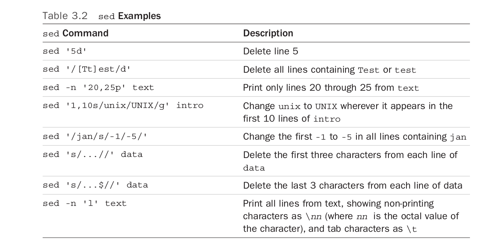

```bash 
sed 's/Unix/UNIX/' intro  
Substitute Unix with UNIX

```
To make the changes permanent:
```bash 
sed 's/Unix/UNIX/' intro > temp 
mv temp intro 

```
1. The `-n` option 
By default,`sed` writes each line of input to standard output, whether or not it gets changed.Sometimes,however,you'll want to use `sed` just to extract specific lines from a file.That's what the `-n` flag is for: it tells `sed` that you don't want it to print any lines by default.
```bash
sed  -n '1,2p' intro
Just print the first two lines 

````
2. Deleting lines 
```bash
sed '1,2d' intro 
```

## tr 
The `tr` filter is used to translate characters from standard input.The general from of the command is `tr from-chars to-chars',where  `from-chars ' and  `to-chars'  are one or more characters or a set of characters.Any character in `from-chars` encountered on the input will be  translted into the corresponding character in `to-class`.The result of the translation is wrtitten to standard output .
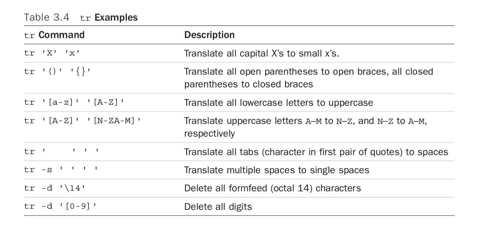
```bash 
tr e x<intro 

```
The input to `tr` must be redirected from the file `intro` because `tr` always expects its input to come from standard input. 
```bash

cut  -d: -f1,6 /etc/passwd | tr : '     '

tr : '\11' 
translate : to tab(\11)

tr '[a-zA-Z]' '[A-Za-z]'<intro 
uppercase to lowercase;lowercse to uoercase

```
1. The `-d` option :
`tr` can be used to delete individual characters from the input stream.
```bash
tr -d from-chars
```
where any character listed in `from-cahrs` will be deleted from standard input.
`tr -d ' ' <intro ` :to delete all spaces from the file `intro`
which equals to 
`sed 's/ //g' intro`

**Bear in mind that `tr` works only on `single` characters**,so if you need to translate anything longer than a single character,you have to use a different program,such as `sed`

##grep
`grep` allows you to search one or more files for a pattern you specify.The general command is `grep pattern files`
```bash
grep  shell *
# find out which ones contain words or phrases in all files
```
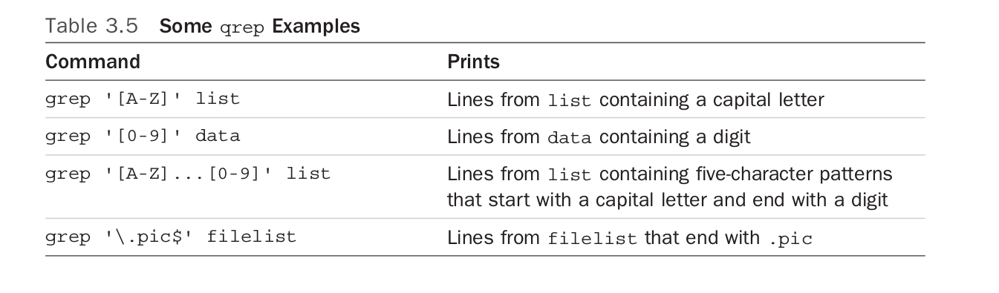
`grep` takes its input from standard input if no file is specified.
1. using `grep` with regular expression
`grep '[Tt]he' intro `
2. The `-i` option 
```bash 
grep -i 'the' intro 
#The `-i` option makes it insenstive  to ignore the difference between upper and lowercase


```
3. The `-v` option
To reverse the logic of the matching task.
```bash
grep  -v 'UNIX' intro  
#print all lines that don't contain UNIX

```
4. The `-l` option 
```bash

grep -l 'Move_history' *.c 
#List the files that contain Move_history
```
5. The `-n` option
Each line from the file that matches the specified pattern is preceded by its corresponding line number.
##sort 
1. The `-u` option 
The `-u` option is to eliminate duplicate lines from the output.
2. The `-r` option 
Reverse sort 
3. The `-o` option 
`sort names >sorted_names` equals to `sort names -o sorted_names` 
4. The `-n` option 
The `-n` option to `sort` specifies that the first field on the line is to be considered a number,and the data 
5. skipping fields
```bash

sort -k2n names
# The `-k2`  says to skip the first field and start the sort analsysis with the second field of each line. By default,the delimit is `\t` or space 

```

6. The `-t` option 
To specify the colon character as the field delimiter(`-t`)
```bash 
sort  -k3n -t: /etc/passwd
sort by user id
```
## uniq 
The `uniq` command is useful when you need to find or remove duplicate lines in file;the basic fomat of the command is 
`uniq in_file  out_file`.In this format,`uniq` copies `in_file` to `out_file`, removing any duplicate lines in the process.`uniq`'s definition of duplicated lines is *consecutive*(连续的) lines that match exactly.


If `out_files` is not specified,the result will be written to standard output.If `in_files` is also not specified ,`uniq` acts as a filter and reads its input from standard input.

```bash
cat names
chunshun 
zhangjia 
chunshun

uniq names
chunshun 
zhangjia 
chunshun
#The multiple occurances(chunshun) are  not consecutive in the file 

sort names | uniq 
chunshun 
zhangjia 


```
1. The `-d` option 
The `-d` option to `uniq` can be used for such purposes:It tells `uniq` to write the duplicated lines to `out_file`(or standard output).List duplicate lines 
```bash
sort names|uniq -d 
chunshun
```
2. Other options 
* The `-c` option to `uniq` adds an occurance count
```bash
sort names |uniq -c 
# count line occurances 
```
One common use of `uniq -c ` is to figure out the most common words in a data_file,easily done with a command like:
`tr '[A-Z]' '[a-z]' data_file |sort|uniq -c|head `

**awk & perl**


    To make the file exectutable,and exectute its contents simply by typing its name to the shell.
```bash 
cat nu
who |wc -l

chmod +x nu 
# make the file nu exectuable 

nu
1

#or ./nu 


```
##shell scripts
1. Variables 
A shell variable begins with an alphabetic or underscore ( _ ) character and is followed by zero or more alphanumeric or underscore characters.


    Unlike most other programming anguages, the shell has no concept of data types.Whenever you assign  a value to a shell variable, the shell only interprets the value as a string of characters.
2. Displaying the variables 
`echo $Variable`
The undefined variables equals to null value.Assign the null value to variable:`variable=''` or `variable=""`
3. Filename substitution and variables 
```bash 
x=*
echo $x
#list all the files in the dictionary
```
3. The ${variable} Construct  

`mv $filename $filenameX`=>`mv $filename ${filename}X`
4. Built-in integer arithmetic 
`$((expression))`  where expression using shell variables and operators.l

    $(()) operators
    +,-,*,/,%,and **, along with more sophisticated notations includoing +=,-=,*=, /=,and variable++,variable--
    also
    `echo $((8#100))` echo 100 in base8,and `echo $((2#1010120)` echos in base2
##Quote 
1. The single quote(')
One of the most common is to keep character sequences that include whitespace together as a single element
`grep 'zhang jia' names` :it ignores any special characters that follow until it sees the matching closing quote;
```bash
text='* means all files in the directory'
echo $text 
#file_a, file_b, file_c means all files in the directory
```
##The double quote 
Double quotes work similarly to single quotes,except they're less protective of their content:single quotes tell the shell to ignore *all* enclosed characters,double quotes say to ignore *most*.In particluar, the following three characters are not ignored inside double quotes:
* Dollat signs($) 
* Back quotes(`)
* Backslashes(\)
```bash 
filelist=* 
echo $filelist 
#file_a,file_b, file_c 

echo '$filelsit' 
$filelist 

echo "$filelist"
* 

```
To make the shell parse the substituted characters later,using the **double quotes **
##The backslash(\)
The backslash escapes the character that immediately follows it.The general format is `\c`
```bash 
echo \>
>

echo \*
*


```
1. Using the backslash for continuing lines 
When a backslash is the last character of a line of input, the shell treats it as a line continuation character.
2. The backslash inside double quotes

        This means that you can use the backslash inside these quotes to remove the
        meaning of characters that otherwise would be interpreted inside double quotes (that is, other
        backslashes, dollar signs, back quotes, newlines, and other double quotes).
```bash
echo "\$x"
$x 

x=5
echo "The value of x is \"$x\"
The value of x is "5"

```
##command substitution

1. The back quote(`)
The back quote is  unlike any of the previously encountered types of quotes because its purpose is not to protect characters from the shell but to tell the shell to replace the encloses command with its output.The general format for using back quote is `command`
```bash 
echo `date`
#2018年 03月 01日 星期四 21:13:36 CST


```
2.  The `$()` construct 
```bash
echo $(date)
#newer and preferred 

#Because single quotes protect everything ,the following output should be clear:
echo '$(who | wc -l) users are  logged in'
$(who |wc -l) users are logged in

echo "$(who | wc -l) users are logged in"
4 users are logged in
    
```


        command substiution is often used to change the values stored in a shell variable.

```bash 
#get the first char 
filename=/users/steve/memos
firstchar=$(echo $filename|cut c1)

#to change every occurance of that character in filename 
filename =$(echo $filename |tr "$firstchar" "^" ) 
# translate / to ^ 
echo $filename 
^users^steve^memos


```
But a single,nested command substiution can perform the same operation:
```bash 
filename=/users/steve/memos 
filename=$(echo $filename | tr "$(echo $filename | cut -c1)" "^")
echo $filename 

^users^steve^memos 

```
##The `expr` command:
The `expr` expression must be separated  by the space.
```bash 
expr 1+2
#doesn't work 

expr 1 + 2
3

expr 10 \* 4 
40  


```
1. other operators:
such as `:`
```bash 
expr "$file" :".*"
#returns the number of characters stored in the variable file,beacause `.*` 
#matches all the characters in the string.

```
##passing arguments
```bash
cat ison 
who | grep $1

chmod +x ison 
./ison chunshun 

chunshun tty7         2018-02-28 18:36 (:0)

```
1. The `$#` Variable
The special shell variable `$#` gets set to the number of arguments that were typed on the command line.This variable is often tested by programs to determine  whether the correct number of arguments was specified by the user
```bash 
cat args
echo $# arguments passed 
echo arg1 =:$1 :arg 2 =:$2 :arg 3 =：$3:

chmod +x args
args a b c 
3 arguments passed 
arg 1 =:a:arg 2 = ：b:arg 3= :c: 

```
2. The `$*` variable
The special variable `$*` references all the arguments passed to the progra.
This is oftern used in programs that take an indeterminate or variable number of arguments.
```bash
cat args2 
echo $# arguments passed 
echo they are :$*:

chmod +x args2
./args2 a b c 
3 arguments passed 
they are :a b c:


```
3. `${n}`
If you supply more than nine arguments to a program, you cannot access the tenth and greater arguments with $10,you should use ${10} instead


## The `shift` command 
The `shift` command allows you to effectively `left-shift` parameters.

# Conditional statement 
1. The `$?` Variable 
The shell variable `$?` is automatically set by the shell to the exit status of the last command exectuted.
2. `if` condition:
```bash 
if command
then 
    command 
    command 
    ...
fi
```
`/dev/null`:the "garbagre can",when you write to it,the bits vanish.
## The `test` command 
Used for testing one or more conditions,its general format is 
`test expresssion`
```bash
blanks="  "
test $blanks
echo $?
1

test "$blanks"
echo $?
0


echo $symbol 
=

test -z "$symbol"
sh:test: argument expected 
# The operaroe = has higher precedence than the -z operator 

test X"$symbol" = X
#which will be true if symbol is null.,and false if it's not 

```

The `X` in front of `symbol` prevents `test` from interpreting the charactes stored in `symbol` as an operator

##An alternative format for `test`
`test expression ` equals to `[expression]` 
```bash 
if ["$name" = julio ]
then 
        echo "would u like to play a game?"
fi 
```
The `[...]` format ,which coaxes shell programming into a synax much more similar to other popular programming languages.
1. Interger operators 
`test` has a large asstorment of operators for programming interger comparisons.

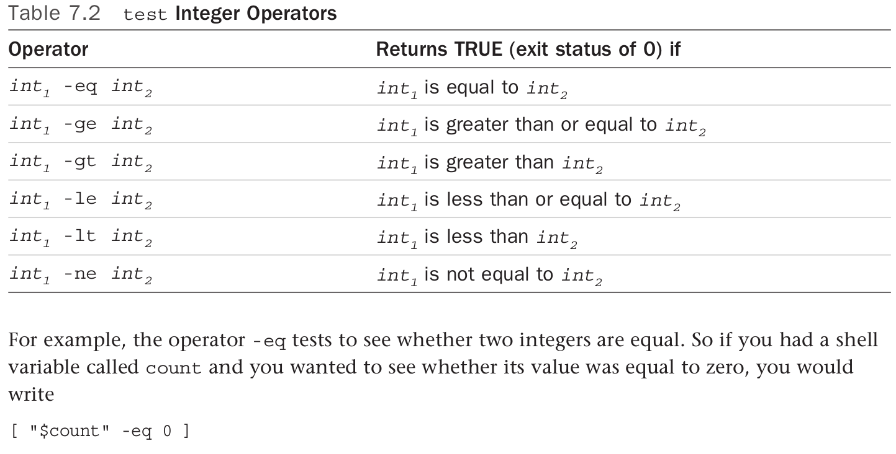
**It's important to note that the  `test` command,not the shell itself,interprets the variable's value as an interger when an interger operator is used,so these comparisons regardless of the shell variable's type**
```bash
x1="005"
x2=" 10"
[ "$x1" = 5 ]
1 #false 

[ "$x1" -eq 5 ]
0 #True


```
The *string* comparison operator `=` test whether the two strings are identical. They're not,because the first string is composed of the three characters 005,and the second the single character 5

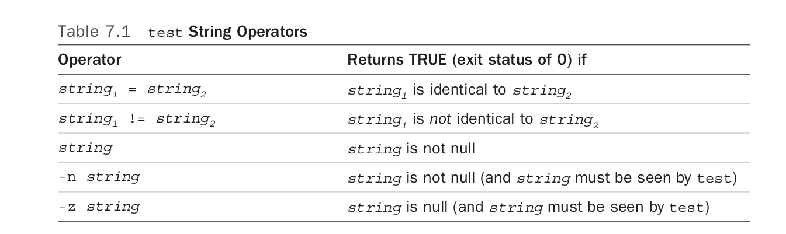
In the second test,the interget comparsion operator `-eq` is used.Treating the two values as intergers(numbers),005 is  equal to 5,as verified by the `test` exit status.
2. File operators  
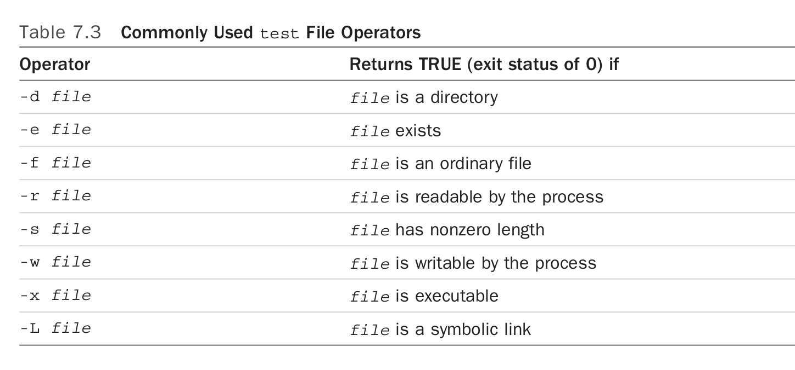
3. The logical negation operator(`!`)
The unary logical negation operator `!` can be placed in front of any other `test` expression to *negate* the result of the evaluation of that expression.

```bash
[ ! -r /users/steve/phoneboook]
```
3. The logical AND operator `-a`
The operator `-a` performs a logical AND of two expressions and returns TRUE only if the two joined expressions are both true.
```bash
[ -f "$mainfile" -a -r "$mainfile" ]

```
4. Parentheses
You can usr parenthesess in a `test` expression to alter the order of evaluation as needed;just make sure that the parentheses themselves are quoted beacuse they have a special meaning to the shell.
```bash 
[ \ ( "$count" -ge 0 \ ) -a \ ("$count" -lt 10  \ )]

```
5. The logical OR operator `-o`
The `-o` operator is similar to the `-a` operator ,only if forms a logical OR of two expressions.
```bash 
[\ ( "$a" -eq 0 -o "$b" -eq 2 \ ) -a "$c" -eq 10 ]

```
##The `else` construct 
A construct known as `else` can be added to the `if` command,with the genaral format as shown:
```bash
if command 
then 
        command 
        command
        ...
else 
        command
        ...
fi 
```
6. The `exit` command 
A built-in shell command called `exit` enables you to immediately ternimate executation of your shell program.The general format of this command is
`ecit n`,where `n` is the exit status that you want returned.If none is specified,the exit status used is that of the last command exectued prior to the `exit`(that is,it's effictively `exit $?`)
7. The `elif` construct 
##The `case` command 
The `case` command allows you to compare a single value against a set of other values or expressions and to execute one or more commands when a match is found.The general command is 
```bash 
case value in 
pattern1) command 
            command 
            command 
            ;;
pattern2) command 
            command 
            command 
    ;;
...
pattern3) command 
            command 
            command 
            ...;;
esac 

    
```
8. The `-x` option for debugging 
9. The NULL command `:`
```bash 

if [...]
then 
        :
        # do nothoing
else 
        command 
        exit 1 
fi     
```

10. The `&& ` and `||`
The shell has two special constructs that enable you to execute a command based on whether the proceding commad succeeds or fails.In case you think this sounds similar to the `if` command,well it is.

## Loops 
1. `for` 
```bash 
for var in word1 word2 word3...wordn
do 
        command 
        command 
        ...
done 

```
This process continues with successive words in the list being assigned to  var and the commands in the loop body being executed until the last word in the list, word n , is assigned to var and the body of the loop executed.
```bash 
for i in 1 2 3 
do 
        echo $i
done

1
2
3

```
2. The $@ variable 
The key difference between `$@` and `$*` is that `$@` behaves just like `$*` without double quotes
```bash 
cat args

for arg in "$@" 
do
        echo $arg 
done

args a b c 
a 
b
c

args 'a b' c 
a b 
c


```
3. The `for` without the list 
A special notation is recognized by the shell when writing `for` commands .If you omit the `in` element and its subsequent list 
```bash
for var 
do 
        command 
        ...
done

```
will be written to 
```bash 
for var in "$@"
do 
        command 
        ...
done
```
4. The `while` command 
The format of this command is 
```bash 
while command1
do 
        command
        command 
        ...
done 
```
If the command1 is zero , the commands enclosed between the `do `and `done` are executed once .(0 equals to True)
4. The `ubtil` ommand 
The `while` command continues execution as long as the test expression continues to return a TRUE(ZERO) exit status.The `until` command is the opposite:It continues executing the code block until the test expression returns a nonezero exit status and stops once a zero status is prodced
```bash
until command 
do 
        command 
        command 
        ...
done 
```


The `until` command is useful for writing programs that  wait for a particular event to occur.

5. The `sleep ` option 
The option suspends execution of the program for `n` seconds.
```bash 

sleep 10;echo hello
```


        By default,all your process are  automatically terminated when you log off the system. If you want a program to running after you've logged off, you can run it with the `nohup` command, or schedule it to run with `at` or from `cron`
##More on loops
1. Breaking out of a loop
`break n` : The `n` innermost loops are immediately exites,so in 
```bash 
for file 
do ...
        while ["$count" lt 10 ]
        do 
                ...
                if [ -n "$error" ]
                then 

                        break 2 
                fi 
        done
        ...
done

```
both the `while` and the `for` loops will be exited if `error` is nonnull
##Skipping the remaining commands in a loop
The continue command is similar to  `break`,the format goes like `cotinue n `,which it causes the commands in the innermost `n` loops to be skipped
```bash
for file 
do
        if [! -e "$file" ]
        then 
                echo "$file not found"
                continue 
        fi 

        ...
done
```
## I/O rediretion on a loop
```bash
for file 
do 
        echo "processing file $file" > /dev/tty
        ...

done > output

```
##Save the error to a file 
```bash 
while [ "endofdata" -ne TRUE ]
do 
        ...
done 2>errors 

```
Output from all commands in the loop writing to standard error will be redirected to the `errors`
##p piping data into and out of a loop
A command's output can be piped into a loop(by having the commands prior to the loop command end with a pipe symbol),and the output from a loop can be piped into another command too.
```bash
for i in 1 2 3
do 
        echo $i 
done | wc -l

```
To write loop in a line 
```bash
for i in 1 2 3 ;do echo $i;done
```
## The `getopts` option
To process command line argument,the general format of the command is 
`getops options variable`
##Reading and Printing Data 
1. The `read` option 
The general format is `read variable`,the commands is used to read data from the ternimal or from a file
`read x y `:read x y from the input 
## special `echo` escape characters
Refers to the shell variable,`echo $$`,prints the ID of the shell
1. The exit status from `read`
##The `printf` command 
Although `echo ` is quite adequate for dispalying simple messages,sometimes to print *formatted* output.

The general format of the `printf` command is 
`printf "format" arg1 arg2...`,just like in C

        The general format if a conversion specification is 
        %[flags][width][.precision]type

flags is required,the others are optional

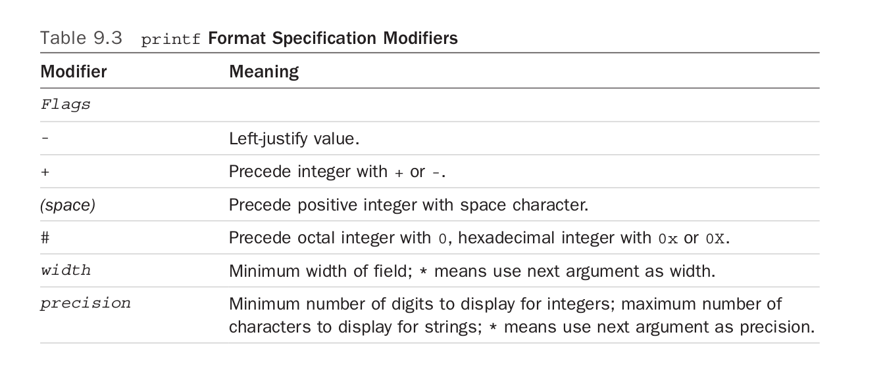
##Envionment in shell
1. subshells 

        Whenever a new shell runs, it runs in its own environment,with its own set od local variables.A subshell has no knowledge of local variables that were assigned values by the login shell(the parent shell).Furthermore, a subshell cannnot change the value of a variable in the parent shell. 
2. exported variables
There is a way to make the value of a variable known to a subshell,and that's by exporting it with the `export` command.The format of this command is simply 
`export variables`,the value of the exported variables will be passed to the subshell 
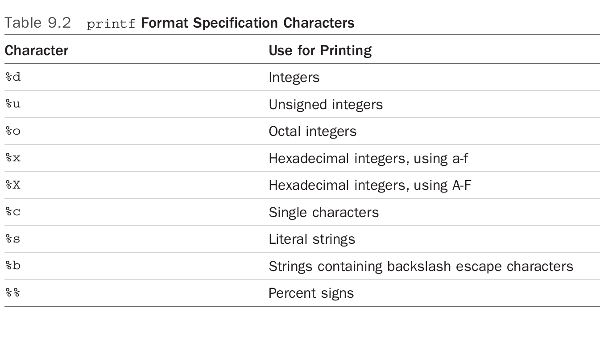
```bash 
cat subshell 
echo $x

x=100
export x
subshell 
100

```

The subshell couldn't change the value of either the local variable `x` or the exported variable `y`,it merely changed its local subshell copy od `y` that was instantiated when it was executed.**In fact,once exported variables get to the subshell , they are local variables**

        There is no way to change the value of a variable in a parent shell from within a subshell


        **After a variable is exported, it remians exported to all subshells subsequently executed**
## PS1 and PS2
##PATH
The important thing to notice is that directories are separated by a colon(:) and that the shell searches them in order, left  to right,to find requested commands or programms


Whenever you type in the name of a program ,the shell searches a list of directories until it finds the requested program


##The (...) and {...} constructs
To group a set of commands together without pipe ,The first form causes the commands to  be exectuted by a subshell, the latter form by the current shell.

```bash 
x=10
(x=100)
#execute in a subshell, x:10

{x100;}
#run in the current shell , x:100

```
##The `.profile` file 
Before the shell displays your command prompt(提示符)，the login shell looks for and reads two special files on the system 

        The first is /etc/profile,set up by the system administator.It generally checks to see whether you have mail(it's where the mail message cpomes from.),sets your default file creation mask,establishes a default PATH,and anything else that the administator wants to have happen whenever a user logs in 

        The second file is `.profile ` in the home directory,you can see it by `cat SHOME/.profile

        You can change your `.profile` file to include any commands that you want executed whenever you log in,including indicating which directory you start out  in, a check of who's logged in,and the instantiation of any system aliases you prefer.
##The TERM variable 
ansi,vt100, xterm
##The TZ variable
The TZ variable is used by the  `date` command for time zone
##parameter 
1. parameter substiution
* ${parameter}: `mv $file ${file}x` 
* ${parameter: -value}:if parameter is not null, use the value of parameter ,and to substitute otherwise 
* ${parameter:=value}:you can't assign values to positional parameteeres this way
* ${parameter:?value}: If parameter is not null,the shell substiutes its values; otherwise,the shell writes values to standard error and then  exits * {parameter:+value}:this one substiutes `value` if `parameter ` is not null; otherwise, it substiutes nothing .It's the opposite of:`-`

2. pattern matching constructs 
The POSIX shell offers four parameter substiution constructs that perform pattern matching.

The construct takes two arguments:a variable name(or parameter number ) and a pattern
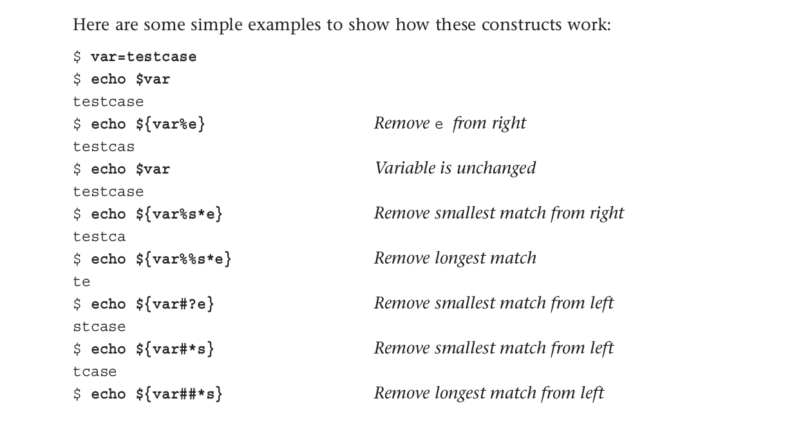

* ${variable%pattern}:To see whether it ends with the specified pattern.If it does,the contents of variable are used,with the **shortest** matching pattern removed from the right

* ${variable %% pattern}:It remoives the **longest** matching pattern removed from the right

* ${variable#pattern}:to use the value of variable on the command line,with pattern removed from the left
* ${variable##pattern}:to use the value of variable on the command line, with pattern removed from tht right 

        remember that the pattern matches are
        anchored. In the case of the % and %% constructs, the values of the variable must end with the
        specified pattern; in the case of the # and ## constructs, the variable must begin with it.

3. ${#variable}
Need to figure out how many characters are stored in a variable
```bash 

text='the shell'
echo ${#text}
```
## The `$0` variable
The shell stores the name of the program inside the special variable `$0`
## The `set` command 
The shell's command also serves two purposes: it's used both to set various shell options and to reassign the postional parameteras `$1 $2` ,and so on 
1. The `-x ` option 
`set -x` enables trace mode,which means all subsequentlty exwcuted commands will be printed to standard error by the shell, after shellname ,variable, and command substitution,as well as I/O redirection has been performed.
Ends it with `set +x`
2. `set` with no arguments 
To show all variables that exist in the current environment,local or exported
3. `set` is often used ins this fishion to "parse" data from a file or the ternimal.
```bash 
read line 
set $line 
echo $#
```
To count the number of words in a line 
4. The `--` option 
To protect against both of these problems occurring,use the `--` option  to `set` .This tells `set` not to interpret any subsquent dashes or argument-format words it encounters  on the command line as options. It also prevent `set` from displaying all your variables if no other arguments follow,as  was the case when you typed a null line

        Here is a quicl way to count the number of files in the directory
        ```bash 
        set *
        echo $#
        ```
        This is much faster than
        `ls | wc -l`
5. The `IFS` variable 
There is a special shell variable called `IFS`,which stands for `internal field separator`. The shell uses the value of this variable when parsing input from the `read` command,output from command substitution (the back-quoting mechanism), and when perfroming variable substitution.IFS contains a set of characters that are used as whitespace separators.
```bash 
IFS=:
read x y
123:345

echo $x $y 
123 345

```
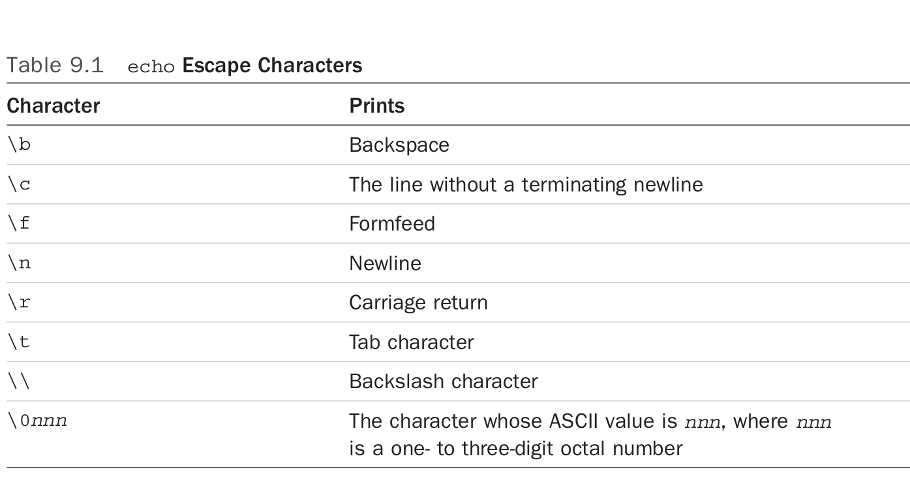
## The `readonly` command 
The `readonly` command is used to specify variables whose values cannot be subsequently changed.For exampe,
`readonly PATH HOME` marks both `PATH` and `HOME` variables as read-only.

## The `unset` command 
To remove the definition of a variable form your environment.But can't` unset a read-only variable.Furthermore , the variable `IFS,MAILCHECK,PATH,PS1,PS2` cannot be `unset` 
#Tricks 
##The `eval` command 
This section describes one of the more unusual  shell commands:`eval` .Its format is as follows:`eval command-line`.

        The effect is that the shell scans the command line twicw before executing it,which can be very useful if the script is building a command that needs to be invoked,among other pprposes
```bash 

pipe= "|“
ls $pipe  wc -l 
|:No such file or directory
Wc:No such file or directory 
-l:No such file or directory 
# The shell takes care of pipes and I/O redirection before variable substitution.


```
When putting `eval` in front of the command sequence gives the dired results
`eval ls $pipe wc -l` ,the first timw the shell scans the command line,it substitutes | as the value of pipe.Then `eval` causes it to rescan the line,at which point the | is recognized by the shell as the pipe symbol

        The `eval`command is frequently used in shell programs that build up command lines inside one or more varoiables.
        If the variabeles contain any characters that must be interpreted by the shell,`eval` is essential. Command terminator (;,|.&), I/O redirection(<,>) ,and quote characters are among the characters that must appear directly on the command line to have special meaning to the shell
## The `wait` command
The format is `wait process-id` ,where `process-id` is the process ID of the process  you want to complete.
If it is omitted,the shell waits for all child process to complete execution.Execution of your current shell will  be suspended until the process or processes finish execution 
## The `$!` variable 
It is the most recently lanuched command's process ID

        To test if a process you've lanuached is still running.The ps command can check  if you use the `-p` flag and the process ID

##The `trap` command
Signal handling in a shell program is done with the `trap` command ,whose general format is `trap commands signals` ,where `commands ` is one or moe commands that will be executed whenever any of the signals specfied by `signals` is received 

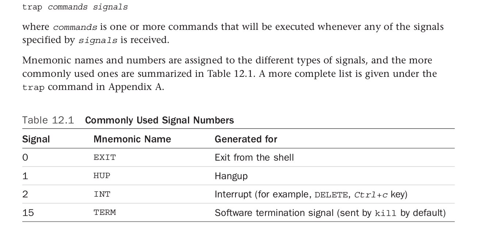

An example of the `trap` command:
```bash 
trap "rm $WORKDIR/work1$$ $WORKDIR/dataout$$; exit" INT

```
If the user interrupts execution of the program after this `trap` is executes you can be assured that these two tempory files will be removed,not left around in the file system

##More on I/O
1. To redirect standard error 
`command 2>file`

file descripter:File descripter 0 is standard input,descripter 1 is standard output,and descriptor 2 is standard error

you may want to redirect both standard output and standard error output from a program into the same fil
`command > foo 2>> foo `,we can also write `command >foo 2 >&1`


```bash 
exec > /tmp/output 
//all commands that subsequently write to standard output will write to /tmp/output unless explicitly redirected elsewhere 


exec 2> /tmp/errors
//All output to standard will go to /tmp/errors


```
## `<&-` and `>&-`
1. In-line input redirection
If the `<<` follows a command in the format 
`command << word`, the line that follows as the  input for `command`,until a line that contains just `word `is found
```bash 
wc -l << ENDOFDATA


```
The shell fed every line typed into the shell as the standard input stream of `wc` until it encountered the line containing just ENDOFDATA


In-line input redirection-also referred to as *here documents* by some programmers-is a powerful feature when used inside shell programs

```bash 

➜  ~ echo "hello" <<END  
heredoc> kf
heredoc> sldm
heredoc> END
hello

```
To avoid all the back quotes intepret by the shell,adding a backsplash on the end-of-docunment word 
```bash
echo "hello<<\END
heredoc> dfh
heredoc> \dskf
heredoc> END 
hello
```
To remove the tab characters in the input,adding a dash(-)
`cat << -END`
##Functions
To define a function,the general format is:
```bash
name(){
        command;
        ...;
        command;

}
```
where `name` is the name of the function,the parameters denote that a function is  being defined 

```bash 

nu(){
        who | wc -l

}
```
##The `type` command 
To find out whether the command is a function,a shell built-in function,a standard Unix command or even a shell alias
## the ENV file 
The ENV file contains commands to set up the shell's environment


##Command-line editing 
```bash 
set -o vi 
set -o emacs

```

## The emacs line EDIT mode 
ctrl+h:

ctr+d:to delete the current character 


## The `fc` command 
```bash 

fc -l 12 34
//list the history command from 12 to 34


fc -n -l -20 
//writes the last 20 commands to standard output 

```

## The  `r` command (Korn shell)
The `r ` command redispalys the previous command and then immediate runs it 
The bash shell has a similat shortcut command.`!string ` lets you search history and `!!` re-executes the previous command
## The `ll` command 
```bash 
ll *.c
//list all the c files 

```
## Removing alias
`unalias name `:remove the alias
`unalias -a`:remove all the alias
##Arrays 
```bash
arr[0]="chunshun"
arr[1]="chun"
arr[2]=1

echo ${arr[0]}
chunshun


echo ${arr[*]}
chunshun chun

echo ${#arr[*]}
2

```

## Job control 
1. The `bg` and `fg` command
The stopped job becomes the current job.To have it continue executinf,uses the `fg` or `  bg ` command:
2 . Output from a background job normally goes directly to the ternimal,the command 
`stty tostop` causes any background job that attempts to write to the  ternimal 
