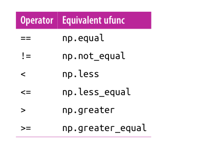
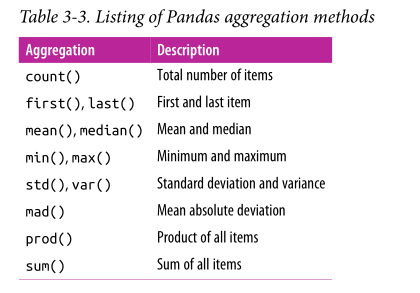
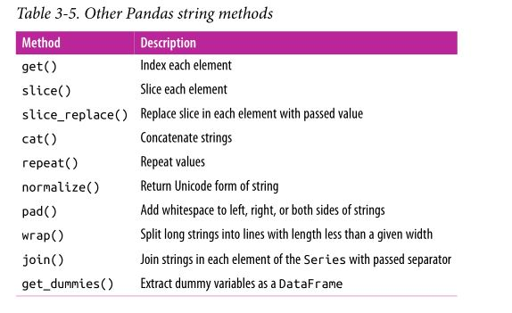

%history -n 1-4
shell commands in ipython
prefix =!


`np.c_`:Translates slice objects to concatenation along the second axis.
`np.r_`:Translates slice objects to concatenation along the first axis.

passing values to and from the shell ;
```python
contents = !ls
print(contents)
```
debug:when reafing tracebacks not enough

%debug
ipdb>


%timeit is much faster than %time

%load_ext   # Load an IPython extension by its module name.

line by line profiling with %lprun
pip install line_profiler
%load_ext line_profiler
%lprun  -f sum _of_lists   sum _of_lists(1000)

profiling memory use: %memit and %mprun
pip install memory_profiler
%load_ext memory_profiler

###subarrays slice
multidimsensional:separated by commas(,)

deep_copy:
```python
x_sub=x_raw[:2,:2]
#    \shallow copy
x_sub=x_raw[:2,:2].copy  
# \deep copy
```


accessing single rows and columns of an arraay by combining and slicing, using an empty slice marked by a single colon(:)

array slicing :accessing subarrays
 x[start: stop :step]
 eg: x[::2] /every other element(每隔一个元素)

concatenation and splitting :
x[0,1]

np.concatenate([x,x],axis=0) //纵轴
np.concatenate([x,x],axis=1) // 横轴

np.concatenate(routine):
np.vstack(vertically)-->np.hstack(horizonally)


computation on Numpy arrays:Universial Functions

vectorized operstions:

Nummpy universial functions:
1. array arithmetic;(算数)

2. abosulate value;
    np.abs
3. trigonmetric functinons;(三角函数)
    np.sin
4. exponents and logarithms;(指数和对数函数)
    np.exp,np.power,np.log2,np.log1p()
5. from scipy import special
    special.gammma

Advanced  Ufunc Features:
1.  specifying output:
    ```python
    y=np.zeros(10)
    np.power(2,x,out=y[::2])
    ptint(y)


    ```
2. Arregates:
    reduce:
    ```python
    x=np.arange(2,9)
    np.add.reduce(x)
    //np.multiply.reduce(x)
    ```
Or:
    ```python
    x= np.random.randint(10,size=(5,6))
    np.add.reduce(x,axis=0)
    np.add.reduce(x,axis=1)
    ```
when you want to store the intermediate results of the computation:
```python
np.add.accumlate(x)
array([[ 9,  3,  9,  1,  0,  5],
       [12,  9, 10,  7,  4,  7],
       [14, 11, 12,  9, 12, 10],
       [17, 18, 19, 14, 20, 12],
       [26, 21, 25, 19, 23, 18]], dtype=int32)
# or
np.add.accumulate(x,axis=1)
array([[ 9, 12, 21, 22, 22, 27],
       [ 3,  9, 10, 16, 20, 22],
       [ 2,  4,  6,  8, 16, 19],
       [ 3, 10, 17, 22, 30, 32],
       [ 9, 12, 18, 23, 26, 32]], dtype=int32)

```

##Aggregations: Min, Max, and Everything in Between:

1. Smmming the Values in an Array:
    ```python
    x= np.random.random(100)
    np.sum(x)
    ```
2. Minimum and Maximum:
    np.min,np.max is much faster than object.min//max
3. Multisimensional aggerates:
    ```python
        xdata=np.random.random((5,4))
        array([[ 0.60512327,  0.87652658,  0.0524589 ,  0.43449801],
                [ 0.76461989,  0.09166599,  0.01874888,  0.36077922],
                [ 0.8992786 ,  0.74476265,  0.38425091,  0.59190059],
                [ 0.36066559,  0.7862146 ,  0.80816679,  0.31818273],
                [ 0.5112592 ,  0.99493422,  0.71303493,  0.07820642]])
    xdata.min(axis=0)
     array([ 0.36066559,  0.09166599,  0.01874888,  0.07820642])
    xdata.min(axis=1)
     array([ 0.0524589 ,  0.01874888,  0.38425091,  0.31818273,  0.07820642])

4. Other aggeration functions:


np.pertentile:百分点

Example:
```python
import seaborn;
seaborn.set();
#设置画布样式
```

Computation on Arrays:Brodcasting(**Another means of vectoriz‐ing operations is to use NumPy’s broadcasting functionality**)
Introducing Brodcasting:
Broadcasting is simply a set of rules for applying binary ufuncs (addition, subtraction, multiplication, etc.) on arrays of different sizes.

eg:
```python
a=np.ones((3,3))
2+a;
```

Rules of Brodcasting:
* Rule 1: If the two arrays differ in their number of dimensions, the shape of the
one with fewer dimensions is padded with ones on its leading (left) side.
* Rule 2: If the shape of the two arrays does not match in any dimension, the array
with shape equal to 1 in that dimension is stretched to match the other shape.
* Rule 3: If in any dimension the sizes disagree and neither is equal to 1, an error is
raised.


Brodcasting in Practice:
1. centering an array:
2. ploting a two-dimensional function:
```python

x=np.linspace(0,5,50)
y=np.linspace(0,5,50)[:,np.newaxis]

z=np.sin(x)**10+np.cos(10+Y*x)* np.cos(x)

import matplotlib.pylot as plt
plt.imshow(z,orign='lower',extent=[0,5,0,5],cmap='viridis')
plt.colorbar()

```

Comparisons, Masks,and Boolean Losgic

Comparision Operators  as ufuncs
'+,-,*,/, and others on arrays leads to element-wise operations,also >,<




Working with Booleann Arrays:
1. Counting entries:
To count  the number of True entries in a Boolean array ,np.count_nonzero is useful:
```python
np.count_nonzero(x6)
np.sum(x<6, axis=1)  # how many values less than 6 in each row

```

2. Boolean operators:
bitwise logic operators , &,|, ^ ,~.
```python
np.sum((x>0.5)&(x <1))

```


Boolean Arrays as Masks:
```python
x[x>3]
array([8, 5, 8, 8, 8, 9, 4, 6, 7, 7, 6, 7, 9, 7, 6, 5, 4, 9, 7, 7])
```
Using the Keywords and\or Versus the Operators &/|

The difference is this: and and or gauge the truth or falsehood of entire object, while &and | refer to bits within each object.

When you use and or or , it’s equivalent to asking Python to treat the object as a single Boolean entity. In Python, all nonzero integers will evaluate as True .

```python
A=np.array([1,0,1,0,0],dtype=bool)
B=np.array([1,0,1,1,1],dtype=bool)
A|B

```

Fancy Indexing:
Exploring Fancy Indexing : it means passing an array of indices to access multiple array elements at once.
```python
 x=np.random.randint(100,size=(10))
 [51 92 14 71 60 20 82 86 74 74]
 ind=[3,7,4]
 x[ind]

ind = np.array([[3, 7],
                [4, 5]])
x[ind]
array([
    [71,86],
    [60,20]
])


x=np.arange(12).reshape((3,4))
array([[ 0,  1,  2,  3],
       [ 4,  5,  6,  7],
       [ 8,  9, 10, 11]])
row=np.array([0,1,2])
col=np.array([2,1,3])
x[row,col]
array([ 2,  5, 11])

x[row[:,np.newaxis],col]
array([[ 2,  1,  3],
       [ 6,  5,  7],
       [10,  9, 11]])
# the return value of fancy indexing reflects the broadcasted shape of the indices;

# Combining Indecing:
x[2,[2,0,1]]
array([10,  8,  9])

# comnbine fancy indexing with slicing:
x[1:,[2,0,1]]
array([[ 6,  4,  5],
       [10,  8,  9]])

# And we can combine fancy indexing with masking:
mask=np.array([1,0,1,0],dtype=bool)
x[row[:, np.newaxis],mask]
array([[ 0,  2],
       [ 4,  6],
       [ 8, 10]])
```

Example:Selecting Random Points:
```python
mean=[0,0]
cov=[
    [1,2],
    [2,5]
]
X=rand.multivariate_normal(mean,cov,100)
X.shape=(100,2)

plt.scatter(X[:,0],X[:,1])

```


```python
# use fancy indexing to select 20 random points
indices=np.random.choice(X.shape[0],20,replace=False)
selection= X[indices]

```

Modifying Values with Fancy Indexing:
used to modify parts of an array.
```python
x=np.zeros(10)
x[[0,0]]=[4,6]
[ 6. 0. 0. 0. 0. 0. 0. 0. 0. 0.]

i = [2, 3, 3, 4, 4, 4]
x[i]+=1
array([ 6., 0., 1., 1., 1., 0., 0., 0., 0., 0.])
#  With this in
# mind, it is not the augmentation that happens multiple times, but the assignment,
# which leads to the rather nonintuitive results.

# want the behavior where the operation is repeated
x=np.zeros(10)
np.add.at(x,i,1)

 array([ 6.,  0.,  1.,  2.,  3.,  0.,  0.,  0.,  0.,  0.])

```

Example: Bining Data
```python
np.searchsorted():Find indices where elements should be inserted to maintain order.
```
****
Sorting Arrays:
sorting the values in a list or array:


    np.random.shuffle and np.random.permutation
    np.random.permutation与np.random.shuffle有两处不同：

    如果传给permutation一个矩阵，它会返回一个洗牌后的矩阵副本；而shuffle只是对一个矩阵进行洗牌，无返回值。
    如果传入一个整数，它会返回一个洗牌后的arange。
Fast Sorting in Numpy: np.sort and np.argsort:
```python
In [31]: b
Out[31]: array([8, 1, 0, 8, 4, 2, 9, 0, 0, 1])

In [32]: np.argsort(b)
Out[32]: array([2, 7, 8, 1, 9, 5, 4, 0, 3, 6], dtype=int64)
```
Sorting along rows or columns:
```python
np.sort(b,axis=0) #sort each colum of b
np.sort(b,axis=1) #sort each row of b
```

Parial Sorts:Partitioning
Like find the **K smallest values** in the array.NumPy provides the np.partition function. The result is a new array with the smallest K values to the left of the partition,and the reamianing values to the right .


Example : k-Nearest Neighbors
```python
X=dist_sq = np.sum((X[:,np.newaxis,:] - X[np.newaxis,:,:]) ** 2, axis=-1)
nearest = np.argsort(dist_sq, axis=1)

#another way:
#If we’re simply interested in the nearest k neighbors, all we need is to partition each
# row so that the smallest k + 1 squared distances come first, with larger distances filling the remaining positions of the array. We can do this with the np.argpartition function:
K=2
nearest_partition = np.argpartition(dist_sq, K + 1, axis=1)
K=2
for i in range(X.shape[0]):
    for j in nearest_partition[i,:K+1]:
        plt.plot(*zip(X[j],X[i],color='black')
```

Structures Data: NumPy's Structures Arrays

**Chaprer3 Data Manipulation with pandas**
The Pandas Series Object:
```python
In [26]: data=pd.Series(np.arange(1,18,2))
In [27]: data
Out[27]:
0     1
1     3
2     5
3     7
4     9
5    11
6    13
7    15
8    17
dtype: int32

In [28]: data.values
Out[28]: array([ 1,  3,  5,  7,  9, 11, 13, 15, 17])

In [29]: data.index
Out[29]: RangeIndex(start=0, stop=9, step=1)


```

**Series as Generalized Numpy array**

    The essential difference is the pres‐ence of the index: while the NumPy array has an implicitly defined integer index used
    to access the values, the Pandas Series has an explicitly defined index associated with
    the values.
```python
data=pd.Series(np.random.rand(5),index=['a','b','c','d','e'])
a    0.431293
b    0.310565
c    0.238603
d    0.546795
e    0.810594
dtype: float64

```

**Series as Specialized Dictionary **

```python
population_dict = {'California': 38332521,
                    'Texas': 26448193,
                    'New York': 19651127,
                    'Florida': 19552860,
                    'Illinois': 12882135}
population= pd.Series(population_dict)
population

California    38332521
Florida       19552860
Illinois      12882135
New York      19651127
Texas         26448193
dtype: int64
```

**Constructing Series objects**

```python
pd.Seies(data,index)

pd.Series([1,2,3]) #omit index
pd.Series(5,index=['a','b','c'])
pd.Series({2:'a',1:'b',3:'c'})

1    b
2    a
3    c
dtype: object

pd.Series({2:'a',1:'b',3:'c'},index=[3,2])

3    c
2    a
dtype: object

```

**The Pandas DataFrame Object**
**DataFrame as a Generalized NumPy Array**
```python
DataFrame as a
# sequence of aligned Series objects. Here, by “aligned” we mean that they share the
# same index.
area_dict = {'California': 423967, 'Texas': 695662, 'NewYork': 141297,
            'Florida': 170312, 'Illinois': 149995}
area=pd.Series(area_dict)
California    423967
Florida       170312
Illinois      149995
New York      141297
Texas         695662
dtype: int64

population
California    38332521
Florida       19552860
Illinois      12882135
New York      19651127
Texas         26448193
dtype: int64

states=pd.DataFrame({'population': population, 'area': area})
              area  population
California  423967    38332521
Florida     170312    19552860
Illinois    149995    12882135
New York    141297    19651127
Texas       695662    26448193

states.index
 Index(['California', 'Florida', 'Illinois', 'New York', 'Texas'], dtype='object')
satates.columns
 Index(['area', 'population'], dtype='object')

states.values
array([[  423967, 38332521],
       [  170312, 19552860],
       [  149995, 12882135],
       [  141297, 19651127],
       [  695662, 26448193]], dtype=int64)

# the DataFrame can be thought of as a generalization of a two-dimensional
# NumPy array, where both the rows and columns have a generalized index for access‐
# ing the data.
```

**DataFrame as Specialized Dictionary**

    A DataFrame maps a column name to a Series of column data.
```python
states['area']
California    423967
Florida       170312
Illinois      149995
New York      141297
Texas         695662
Name: area, dtype: int64

states['population'] #satates[states.columns[1]]
California    38332521
Florida       19552860
Illinois      12882135
New York      19651127
Texas         26448193
Name: population, dtype: int64
```

    Notice the potential point of confusion here: in a two-dimensional NumPy array, data[0] will return the first row. For a DataFrame , data['col0'] will return the first column. Because of this, it is probably better to think about DataFrame s as generalized dictionaries rather than generalized arrays, though both ways of looking at the situation can be useful.

**Constructing DataFrame objects**

pd.DataFrame(data,index,columns)
1. From a single Series object:
```python
    pd.DataFrame(population, columns=['population'])
                population
California    38332521
Florida       19552860
Illinois      12882135
New York      19651127
Texas         26448193
```
2. From a list of dicts
```python
data = [{'a': i,'b': j} for i,j in zip(range(10),range(2,12))]
[{'a': 0, 'b': 2},
 {'a': 1, 'b': 3},
 {'a': 2, 'b': 4},
 {'a': 3, 'b': 5},
 {'a': 4, 'b': 6},
 {'a': 5, 'b': 7},
 {'a': 6, 'b': 8},
 {'a': 7, 'b': 9},
 {'a': 8, 'b': 10},
 {'a': 9, 'b': 11}]

pd.DataFrame(data)
   a   b
0  0   2
1  1   3
2  2   4
3  3   5
4  4   6
5  5   7
6  6   8
7  7   9
8  8  10
9  9  11
```
3. From a two-dimensional NumPy array.

        Given a two-dimensional array of data, we can      create a DataFrame with any specified column and index names. If omitted, an integer
        index will be used for each
```python
In [121]: df(np.random.rand(3,2),columns=['foo','bar' ], index=['a','b','c'])
Out[121]:
        foo       bar
a  0.690042  0.428023
b  0.953353  0.507619
c  0.398207  0.571523

```
4. From a NumPy structured array.
```python

In [122]:  A = np.zeros(3, dtype=[('A', 'i8'), ('B', 'f8')])

In [123]: A
Out[123]:
array([(0,  0.), (0,  0.), (0,  0.)],
      dtype=[('A', '<i8'), ('B', '<f8')])

In [124]: df(A)
Out[124]:
   A    B
0  0  0.0
1  0  0.0
2  0  0.0

In [125]:


```

Pandas Index Onject:

    This Index object is an interesting structure in itself, and it can be thought of either as an immutable array or as an ordered set (technically a multiset, as Index objects may contain repeated values).

1. index as Immutable array

        The Index object in many ways operates like an array.
```python
ind=pd.Index([2,3,4,5,6,6,7])
print(ind.size, ind.shape, ind.ndim,ind.dtype)
```
    This immutability makes it safer to share indices between multiple DataFrame s and
    arrays, without the potential for side effects from inadvertent index modification.
2. index as ordered set

```python
IndA=pd.Index([1,2,3,4])
IndB=pd.Index([2,3,4,5,6])

In [158]: IndA | IndB #union
Out[158]: Int64Index([1, 2, 3, 4, 5, 6], dtype='int64')

In [159]: IndA & IndB #intersection
Out[159]: Int64Index([2, 3, 4], dtype='int64')

In [160]: IndA ^ IndB #symmetric difference
Out[160]: Int64Index([1, 5, 6], dtype='int64')
```

Data Indexing and Selection:
1. Data Selection in Series
* Series as Dictionary
```python
ser=pd.Series(np.arange(0,10,2),index=['a','b','c','e','f'])
        # We can also use dictionary-like Python expressions and methods to examine the
        # keys/indices and values:
In [186]: ser.keys()
Out[186]: Index(['a', 'b', 'c', 'e', 'f'], dtype='object')

In [187]: *(ser.items()),
Out[187]: (('a', 0), ('b', 2), ('c', 4), ('e', 6), ('f', 8))

In [188]: [*ser.items()]
Out[188]: [('a', 0), ('b', 2), ('c', 4), ('e', 6), ('f', 8)]


```
* Series as One-dimensional array

        A Series builds on this dictionary-like interface and provides array-style item selec‐
        tion via the same basic mechanisms as NumPy arrays—that is, slices, masking, and
        fancy indexing.

```python
#sliing by implicit interger index
In [192]: ser[0:4]
Out[192]:
a    0
b    2
c    4
e    6
dtype: int32

#slicing by explicit index
In [193]: ser['a':'d']
Out[193]:
a    0
b    2
c    4
dtype: int32


#masking

In [196]: ser[(ser>4)&(ser<7)]
Out[196]:
e    6
dtype: int32

#fancy indexing
In [197]: ser[['a','e','f']]
Out[197]:
a    0
e    6
f    8
dtype: int32
```
        Among these, slicing may be the source of the most confusion. Notice that when you
        are slicing with an explicit index (i.e., data['a':'c'] ), the final index is included in
        the slice, while when you’re slicing with an implicit index (i.e., data[0:2] ), the final
        index is excluded from the slice.

**Indexers:loc,iloc,and ix **

        Pandas provides some special indexer attributes that explicitly expose certain indexing schemes

1. loc: the loc attribute allows indexing and slicing that always references the **explicit** index,Purely label-location based indexer for selection by label.
```python
In [229]: ser.loc['a':'e']
Out[229]:
a    0
b    2
c    4
e    6
dtype: int32

In [230]: ser.loc['a']
Out[230]: 0
```

2. The iloc attribute allows indexing and slicing that always references the **implicit**
Python-style index:
```python
In [231]: ser.iloc[1:3]
Out[231]:
b    2
c    4
dtype: int32

In [232]: ser.iloc[3]
Out[232]: 6

In [233]: ser
Out[233]:
a    0
b    2
c    4
e    6
f    8
dtype: int32

```
    The explicit nature of loc and iloc make them very useful in maintaining clean and readable code;
3. *ix*,is a hybrid of the two, and for Series objects is equivalent to standard [] -based indexing. The purpose of the ix indexer will become more apparent in the context of DataFrame objects

Data Selextion in DataFrame
1. DataFrame a dictionary
```python
In [262]: data
Out[262]:
              area  population
California  423967    38332521
Florida     170312    19552860
Illinois    149995    12882135
New York    141297    19651127
Texas       695662    26448193

In [265]: data['area']
Out[265]:
California    423967
Florida       170312
Illinois      149995
New York      141297
Texas         695662
Name: area, dtype: int64

In [274]: data['density']= data['population']/data['area']

In [275]: data
Out[275]:
              area  population     density
California  423967    38332521   90.413926
Florida     170312    19552860  114.806121
Illinois    149995    12882135   85.883763
New York    141297    19651127  139.076746
Texas       695662    26448193   38.018740

```

2. DataFrame as two-dimensional array
```python
In [287]: data.loc[:'Texas',:]
Out[287]:
              area  population     density
California  423967    38332521   90.413926
Florida     170312    19552860  114.806121
Illinois    149995    12882135   85.883763
New York    141297    19651127  139.076746
Texas       695662    26448193   38.018740

In [288]: data.iloc[::2,1:]
Out[288]:
            population    density
California    38332521  90.413926
Illinois      12882135  85.883763
Texas         26448193  38.018740

In [298]: data.area
Out[298]:
California    423967
Florida       170312
Illinois      149995
New York      141297
Texas         695662
Name: area, dtype: int64

```
    *ix*,supports mixed integer and label based access. It is
    primarily label based, but will fall back to integer positional access unless the corresponding axis is of integer type.
```python
# The ix indexer allows a hybrid of these two approaches:
In [293]: data.ix[:3,'density']
Out[293]:
California     90.413926
Florida       114.806121
Illinois       85.883763
Name: density, dtype: float64

In [299]: data.loc[data.density>100]['area']
Out[299]:
Florida     170312
New York    141297
Name: area, dtype: int64

In [300]: data.loc[data.density>100,['area','density']
     ...: ]
Out[300]:
            area     density
Florida   170312  114.806121
New York  141297  139.076746

```
3. Additional indexing conventions
```python
In [308]: data['Florida':]
Out[308]:
            area  population     density
Florida   170312    19552860  114.806121
Illinois  149995    12882135   85.883763
New York  141297    19651127  139.076746
Texas     695662    26448193   38.018740
# data['Florida']/data['Florida',:]  error

In [313]: data.population
Out[313]:
California    38332521
Florida       19552860
Illinois      12882135
New York      19651127
Texas         26448193
Name: population, dtype: int64

In [316]: data[1:3]
Out[316]:
            area  population     density
Florida   170312    19552860  114.806121
Illinois  149995    12882135   85.883763

# data['population':] error
```

**Operatinf on Data in Pandas**
1. Ufuncs Index Preservation
```python
In [328]: xx
Out[328]:
          A         B
0  0.969389  0.892697
1  0.188345  0.279597
2  0.917176  0.816024
3  0.646072  0.083937
4  0.869617  0.801786
5  0.428858  0.772485
6  0.208517  0.696207
7  0.538249  0.813255
8  0.714282  0.520245
9  0.595859  0.899295

In [331]: np.sin(xx)
Out[331]:
          A         B
0  0.824540  0.778767
1  0.187233  0.275968
2  0.793887  0.728428
3  0.602054  0.083839
4  0.764082  0.718599
5  0.415832  0.697917
6  0.207009  0.641312
7  0.512634  0.726527
8  0.655075  0.497093
9  0.561220  0.782889


```

2. Ufuncs: Index Alignment
* Index alignment in Series
```python
In [332]: area = pd.Series({'Alaska': 1723337, 'Texas': 695662,
     ...: 'California': 423967}, name='area')

In [333]: population = pd.Series({'California': 38332521, 'Texas': 26448193,
     ...: 'New York': 19651127}, name='population')
In [335]: population/area
Out[335]:
Alaska              NaN
California    90.413926
New York            NaN
Texas         38.018740
dtype: float64

In[10]: A.add(B, fill_value=0)
Out[10]: 0 2.0
1 5.0
2 9.0
3 5.0
dtype: float64
```
* Index alignment in DataFrame
```python
In [354]: xx=pd.DataFrame(x,columns=list('ABCDE'))

In [355]: xx
Out[355]:
          A         B         C         D         E
0  0.969325  0.297429  0.016145  0.453151  0.892244
1  0.888043  0.015756  0.811660  0.210640  0.223727
2  0.110363  0.720436  0.522018  0.846723  0.764437
3  0.765387  0.566216  0.405060  0.990189  0.698027
4  0.026702  0.617554  0.849266  0.695876  0.865932
5  0.070254  0.292769  0.638378  0.344895  0.333732
6  0.894135  0.676939  0.949744  0.249807  0.955615
7  0.805552  0.790793  0.998306  0.367458  0.621286
8  0.367561  0.813858  0.112009  0.197021  0.185958
9  0.024577  0.759787  0.023271  0.162532  0.952512


In [401]: A.add(B,fill_value=A.stack().mean())
Out[401]:
      A     B    C
0  10.0   7.0  5.5
1  17.0   7.0  8.5
2  12.5  14.5  5.5

In [402]: A
Out[402]:
    A  B
0   4  2
1  12  4

In [403]: B
Out[403]:
   B  A  C
0  5  6  0
1  3  5  3
2  9  7  0

In [404]: A+B
Out[404]:
      A    B   C
0  10.0  7.0 NaN
1  17.0  7.0 NaN
2   NaN  NaN NaN
```

**Ufuncs: Oper5ations between DataFrame and Series **

        Operations between a DataFrame and a Series are similar to operations between a two-dimensuional and one-dimensional NumPy array.

```python
In [415]: df
Out[415]:
   Q  R  S  T
0  5  6  4  3
1  3  0  9  6
2  5  0  2  9

In [418]: df.subtract(df['R'],axis=0)
Out[418]:
   Q  R  S  T
0 -1  0 -2 -3
1  3  0  9  6
2  5  0  2  9

In [437]: df-halfrow
Out[437]:
     Q   R    S   T
0  0.0 NaN  0.0 NaN
1 -2.0 NaN  5.0 NaN
2  0.0 NaN -2.0 NaN

In [438]: df
Out[438]:
   Q  R  S  T
0  5  6  4  3
1  3  0  9  6
2  5  0  2  9

In [440]: halfrow
Out[440]:
Q    5
S    4
Name: 0, dtype: int32

```
##Handing Missing Data
    missing data like *null,NaN,NA*

1. Trade-offs in Missing Data Conventions

        A number of schemes have been developed to indicate the presence of missing data in
        a table or DataFrame . Generally, they revolve around one of two strategies: using a
        mask that globally indicates missing values, or choosing a sentinel value that indicates
        a missing entry.
```python

```
2. Missing Data in Pandas
...

##Combining DataSet: Concat and Append
1. Simple Concatenation with pd.concat

        pd.concat() can be used for a simple concatenation of Series or DataFrame objects,
        just as np.concatenate() can be used for simple concatenations of arrays:
```python
In [464]: ser1 = pd.Series(['A', 'B', 'C'], index=[1, 2, 3])
     ...: ser2 = pd.Series(['D', 'E', 'F'], index=[4, 5, 6])
     ...: pd.concat([ser1, ser2])
     ...:
Out[464]:
1    A
2    B
3    C
4    D
5    E
6    F
dtype: object

In [471]: df1
Out[471]:
    A   B   C
0  A0  B0  C0
1  A1  B1  C1
2  A2  B2  C2
3  A3  B3  C3

In [472]: df2
Out[472]:
    J   O   Q
2  J2  O2  Q2
3  J3  O3  Q3
4  J4  O4  Q4

In [473]: pd.concat([df1,df2])
Out[473]:
     A    B    C    J    O    Q
0   A0   B0   C0  NaN  NaN  NaN
1   A1   B1   C1  NaN  NaN  NaN
2   A2   B2   C2  NaN  NaN  NaN
3   A3   B3   C3  NaN  NaN  NaN
2  NaN  NaN  NaN   J2   O2   Q2
3  NaN  NaN  NaN   J3   O3   Q3
4  NaN  NaN  NaN   J4   O4   Q4
In [474]: pd.concat([df1,df2],axis=1)
Out[474]:
     A    B    C    J    O    Q
0   A0   B0   C0  NaN  NaN  NaN
1   A1   B1   C1  NaN  NaN  NaN
2   A2   B2   C2   J2   O2   Q2
3   A3   B3   C3   J3   O3   Q3
4  NaN  NaN  NaN   J4   O4   Q4
```
2. Duplicate indices

        One important difference between np.concatenate and pd.concat is that Pandas
        concatenation preserves indices, even if the result will have duplicate indices!

```python
In [473]: pd.concat([df1,df2])
Out[473]:
     A    B    C    J    O    Q
0   A0   B0   C0  NaN  NaN  NaN
1   A1   B1   C1  NaN  NaN  NaN
2   A2   B2   C2  NaN  NaN  NaN
3   A3   B3   C3  NaN  NaN  NaN
2  NaN  NaN  NaN   J2   O2   Q2
3  NaN  NaN  NaN   J3   O3   Q3
4  NaN  NaN  NaN   J4   O4   Q4
```
3. Catching the repeats as anm error
```python
In [473]: pd.concat([df1,df2])
Out[473]:
     A    B    C    J    O    Q
0   A0   B0   C0  NaN  NaN  NaN
1   A1   B1   C1  NaN  NaN  NaN
2   A2   B2   C2  NaN  NaN  NaN
3   A3   B3   C3  NaN  NaN  NaN
2  NaN  NaN  NaN   J2   O2   Q2
3  NaN  NaN  NaN   J3   O3   Q3
4  NaN  NaN  NaN   J4   O4   Q4

In [14]: pd.concat([df1,df2],ignore_index=True)
Out[14]:
     A    B    C    J    O    Q
0   A0   B0   C0  NaN  NaN  NaN
1   A1   B1   C1  NaN  NaN  NaN
2   A2   B2   C2  NaN  NaN  NaN
3   A3   B3   C3  NaN  NaN  NaN
4  NaN  NaN  NaN   J2   O2   Q2
5  NaN  NaN  NaN   J3   O3   Q3
6  NaN  NaN  NaN   J4   O4   Q4

```

4. Adding MultiIndex keys.

        Another alternative is to use the keys option to specify a label for the data sources; the result will be a hierarchically indexed series containing the
        data:
```python
In [18]: pd.concat([df1,df2],keys=['df1','df2'])
Out[18]:
         A    B    C    J    O    Q
df1 0   A0   B0   C0  NaN  NaN  NaN
    1   A1   B1   C1  NaN  NaN  NaN
    2   A2   B2   C2  NaN  NaN  NaN
    3   A3   B3   C3  NaN  NaN  NaN
df2 2  NaN  NaN  NaN   J2   O2   Q2
    3  NaN  NaN  NaN   J3   O3   Q3
    4  NaN  NaN  NaN   J4   O4   Q4
```
<!-- The result is a multiply indexed DataFrame -->
5. Concatentation with join

        By default, the entries for which no data is available are filled with NA values. To change this, we can specify one of several options for the join and join_axes param‐
        eters of the concatenate function. By default, the join is a union of the input columns
        ( join='outer' ), but we can change this to an intersection of the columns using join='inner'
```python
In [31]: df5
Out[31]:
    A   B   C
1  A1  B1  C1
2  A2  B2  C2

In [33]: df6
Out[33]:
    B   C   D
3  B3  C3  D3
4  B4  C4  D4


In [28]: pd.concat([df5,df6])
Out[28]:
     A   B   C    D
1   A1  B1  C1  NaN
2   A2  B2  C2  NaN
3  NaN  B3  C3   D3
4  NaN  B4  C4   D4

In [29]: pd.concat([df5,df6],join='inner')
Out[29]:
    B   C
1  B1  C1
2  B2  C2
3  B3  C3
4  B4  C4

In [30]: pd.concat([df5,df6],join='outer')
Out[30]:
     A   B   C    D
1   A1  B1  C1  NaN
2   A2  B2  C2  NaN
3  NaN  B3  C3   D3
4  NaN  B4  C4   D4

In [45]:  print(pd.concat([df5, df6], join_axes=[df5.columns]))
     A   B   C
1   A1  B1  C1
2   A2  B2  C2
3  NaN  B3  C3
4  NaN  B4  C4

```

6. The `append()` method

        Keep in mind that unlike the append() and extend() methods of Python lists, the
        append() method in Pandas does not modify the original object—instead, it creates a
        new object with the combined data.

##Combining DataSets:Merge and Join
1. Relational Algebra

        The behavior implemented in pd.merge() is a subset of what is known as relational algebra
2. Categories of Joins
* one-to-one joins:

        Additionally, keep in mind that the merge in general discards the index, except in the special case of merges by index
```python
In [49]: pd.merge(df1, df2)
Out[49]:
  employee        group  hire_date
0      Bob   Accounting       2008
1     Jake  Engineering       2012
2     Lisa  Engineering       2004
3      Sue           HR       2014

In [50]: df1
Out[50]:
  employee        group
0      Bob   Accounting
1     Jake  Engineering
2     Lisa  Engineering
3      Sue           HR

In [51]: df2
Out[51]:
  employee  hire_date
0     Lisa       2004
1      Bob       2008
2     Jake       2012
3      Sue       2014
```
* many-to-one joins

        Many-to-one joins are joins in which one of the two key columns contains duplicate entries.
```python
In [57]: df3
Out[57]:
  employee        group  hire_date
0      Bob   Accounting       2008
1     Jake  Engineering       2012
2     Lisa  Engineering       2004
3      Sue           HR       2014

In [58]: df4
Out[58]:
         group supervisor
0   Accounting      Carly
1  Engineering      Guido
2           HR      Steve

In [59]: pd.merge(df3,df4)
Out[59]:
  employee        group  hire_date supervisor
0      Bob   Accounting       2008      Carly
1     Jake  Engineering       2012      Guido
2     Lisa  Engineering       2004      Guido
3      Sue           HR       2014      Steve

```
* many-to-many joins

        Many-to-many joins are a bit confusing conceptually, but are nevertheless well defined, If the key column in both the left and right array contains duplicates, then the result is a many-to-many merge. This will be perhaps most clear with a concrete example.

```python

In [74]: df5
Out[74]:
         group        skills
0   Accounting          math
1   Accounting  spreadsheets
2  Engineering        coding
3  Engineering         linux
4           HR  spreadsheets
5           HR  organization

In [75]: pd.merge(df1,df5)
Out[75]:
  employee        group        skills
0      Bob   Accounting          math
1      Bob   Accounting  spreadsheets
2     Jake  Engineering        coding
3     Jake  Engineering         linux
4     Lisa  Engineering        coding
5     Lisa  Engineering         linux
6      Sue           HR  spreadsheets
7      Sue           HR  organization

In [76]: df1
Out[76]:
  employee        group
0      Bob   Accounting
1     Jake  Engineering
2     Lisa  Engineering
3      Sue           HR
```

3. Specification of the Merge Key

        it looks for one or more
        matching column names between the two inputs, and uses this as the key. However,
        often the column names will not match so nicely, and pd.merge() provides a variety
        of options for handling this.
* The on keyword
```python
In [77]: df1
Out[77]:
  employee        group
0      Bob   Accounting
1     Jake  Engineering
2     Lisa  Engineering
3      Sue           HR

In [78]: df2
Out[78]:
  employee  hire_date
0     Lisa       2004
1      Bob       2008
2     Jake       2012
3      Sue       2014

In [79]: pd.merge(df1 ,df2,on='employee')
Out[79]:
  employee        group  hire_date
0      Bob   Accounting       2008
1     Jake  Engineering       2012
2     Lisa  Engineering       2004
3      Sue           HR       2014

In [80]: pd.merge(df1,df2)
Out[80]:
  employee        group  hire_date
0      Bob   Accounting       2008
1     Jake  Engineering       2012
2     Lisa  Engineering       2004
3      Sue           HR       2014
# This option works only if both the left and right DataFrame s have the specified col‐
# umn name
```
* The left_on and right_on keywords

        At times you may wish to merge two datasets with different column names; for exam‐
        ple, we may have a dataset in which the employee name is labeled as “name” rather
        than “employee”. In this case, we can use the left_on and right_on keywords to
        specify the two column names:
```python
In [98]: df1
Out[98]:
  employee        group
0      Bob   Accounting
1     Jake  Engineering
2     Lisa  Engineering
3      Sue           HR
In [95]: df3
Out[95]:
   name  salary
0   Bob   70000
1  Jake   80000
2  Lisa  120000
3   Sue   90000

In [96]: pd.merge(df1,df3,left_on='employee', right_on='name')
Out[96]:
  employee        group  name  salary
0      Bob   Accounting   Bob   70000
1     Jake  Engineering  Jake   80000
2     Lisa  Engineering  Lisa  120000
3      Sue           HR   Sue   90000
```

* The left_index and right_index keywords

        Sometimes, rather than merging on a column, you would instead like to merge on an index. For example, your data might look like this:
```python
In [99]: df1a = df1.set_index('employee')
    ...: df2a = df2.set_index('employee')
    ...:

In [100]: df1a
Out[100]:
                group
employee
Bob        Accounting
Jake      Engineering
Lisa      Engineering
Sue                HR

In [101]: df2a
Out[101]:
          hire_date
employee
Lisa           2004
Bob            2008
Jake           2012
Sue            2014

In [102]: df1
Out[102]:
  employee        group
0      Bob   Accounting
1     Jake  Engineering
2     Lisa  Engineering
3      Sue           HR

In [103]: df2
Out[103]:
  employee  hire_date
0     Lisa       2004
1      Bob       2008
2     Jake       2012
3      Sue       2014

# You can use the index as the key for merging by specifying the left_index and/or
# right_index flags in pd.merge()
In [104]: print(pd.merge(df1a, df2a, left_index=True, right_index=True))
                group  hire_date
employee
Bob        Accounting       2008
Jake      Engineering       2012
Lisa      Engineering       2004
Sue                HR       2014
```

4. Specifying Set Arithmetic for Joins

`pd.merge(df6, df7, how='inner')`

* An outer join returns a join over the union of the input columns, and fills in all missing values with NAs:

`pd.merge(df6, df7, how='outer')`
```python
df6 df7 pd.merge(df6, df7, how='outer')
name food        name drink       name food drink
0 Peter fish   0 Mary wine      0 Peter fish NaN
1 Paul beans   1 Joseph beer    1 Paul beans NaN
2 Mary bread   2 Mary bread wine
3 Joseph NaN beer
```
* The left join and right join return join over the left entries and right entries
```python
print(pd.merge(df6, df7, how='left'))
  name food drink
0 Peter fish NaN
1 Paul beans NaN
2 Mary bread wine
```
5. Overlapping Column Names: The suffixes Keyword

         when DataFrame s have conflicting column names
```python
In [113]: df8
Out[113]:
   name  rank
0   Bob     1
1  Jake     2
2  Lisa     3
3   Sue     4

In [114]: df9
Out[114]:
   name  rank
0   Bob     3
1  Jake     1
2  Lisa     4
3   Sue     2

In [115]: pd.merge(df8,df9,on='name')
Out[115]:
   name  rank_x  rank_y
0   Bob       1       3
1  Jake       2       1
2  Lisa       3       4
3   Sue       4       2

In [116]: pd.merge(df8,df9,on='name',suffixes=['_L','_R'])
Out[116]:
   name  rank_L  rank_R
0   Bob       1       3
1  Jake       2       1
2  Lisa       3       4
3   Sue       4       2
```
6. Aggregation and Grouping

        An essential piece of analysis of large data is efficient summarization: computing
        aggregations like sum() , mean() , median() , min() , and max() , in which a single num‐
        ber gives insight into the nature of a potentially large dataset

`pandas.DataFrame.describle()`

7. GroupBy :Split,Apply,Combine

        The name “group by” comes from a command in the SQL database language, but it is perhaps more illuminative to think of it in the terms first coined by Hadley Wickham of Rstats fame: split, apply, combine.
1. split, apply,combine
* The *split* step involves breaking up and grouping a DataFrame depending on the value of the specified key.
* The *apply* step involves computing some function, usually an aggregate, transfor‐
mation, or filtering, within the individual groups.
* The *combine*step merges the results of these operations into an output array.


            The power of the GroupBy is that it
            abstracts away these steps: the user need not think about how the computation is
            done under the hood, but rather thinks about the operation as a whole.

            his object is where the magic is: you can think of it as a special view of the
    DataFrame , which is poised to dig into the groups but does no actual computation
    until the aggregation is applied. This “lazy evaluation” approach means that common
    aggregates can be implemented very efficiently in a way that is almost transparent to
    the user.
* The groupby project

        The GroupBy object is a very flexible abstraction. In many ways, you can simply treat
        it as if it’s a collection of DataFrame s, and it does the difficult things under the hood.
* Column indexing

        The GroupBy object supports column indexing in the same way as the DataFrame , and returns a modified GroupBy object
* Iteration over groups.

        The GroupBy object supports direct iteration over the groups, returning each group as a Series or DataFrame
```python
In [177]: planets.columns
Out[177]: Index(['method', 'number', 'orbital_period', 'mass', 'distance', 'year'], dtype='object')


In [178]: planets=pd.read_csv('https://raw.githubusercontent.com/mwaskom/seaborn-data/master/planets.csv')

In [180]: planets.groupby('method')['mass'].median()
Out[180]:
method
Astrometry                         NaN
Eclipse Timing Variations        5.125
Imaging                            NaN
Microlensing                       NaN
Orbital Brightness Modulation      NaN
Pulsar Timing                      NaN
Pulsation Timing Variations        NaN
Radial Velocity                  1.260
Transit                          1.470
Transit Timing Variations          NaN
Name: mass, dtype: float64


In [182]: for (method, group) in planets.groupby('method'):
     ...:     print("{0:30s} shape={1}".format(method, group.shape))
     ...:
Astrometry                     shape=(2, 6)
Eclipse Timing Variations      shape=(9, 6)
Imaging                        shape=(38, 6)
Microlensing                   shape=(23, 6)
Orbital Brightness Modulation  shape=(3, 6)
Pulsar Timing                  shape=(5, 6)
Pulsation Timing Variations    shape=(1, 6)
Radial Velocity                shape=(553, 6)
Transit                        shape=(397, 6)
Transit Timing Variations      shape=(4, 6)


```

* Dispatch methods

        This is just one example of the utility of dispatch methods. Notice that they are  applied to each individual group, and the results are then combined within GroupBy
        and returned.
```python
In [185]: planets.groupby('method')['year'].describe()
Out[185]:
                               count         mean       std     min      25%  \ method
Astrometry                       2.0  2011.500000  2.121320  2010.0  2010.75
Eclipse Timing Variations        9.0  2010.000000  1.414214  2008.0  2009.00
Imaging                         38.0  2009.131579  2.781901  2004.0  2008.00
Microlensing                    23.0  2009.782609  2.859697  2004.0  2008.00
Orbital Brightness Modulation    3.0  2011.666667  1.154701  2011.0  2011.00
Pulsar Timing                    5.0  1998.400000  8.384510  1992.0  1992.00
Pulsation Timing Variations      1.0  2007.000000       NaN  2007.0  2007.00
Radial Velocity                553.0  2007.518987  4.249052  1989.0  2005.00
Transit                        397.0  2011.236776  2.077867  2002.0  2010.00
Transit Timing Variations        4.0  2012.500000  1.290994  2011.0  2011.75

                                  50%      75%     max
method
Astrometry                     2011.5  2012.25  2013.0
Eclipse Timing Variations      2010.0  2011.00  2012.0
Imaging                        2009.0  2011.00  2013.0
Microlensing                   2010.0  2012.00  2013.0
Orbital Brightness Modulation  2011.0  2012.00  2013.0
Pulsar Timing                  1994.0  2003.00  2011.0
Pulsation Timing Variations    2007.0  2007.00  2007.0
Radial Velocity                2009.0  2011.00  2014.0
Transit                        2012.0  2013.00  2014.0
Transit Timing Variations      2012.5  2013.25  2014.0


In [186]: planets.groupby('method')['year'].describe().unstack()
Out[186]:
       method
count  Astrometry                          2.000000
       Eclipse Timing Variations           9.000000
       Imaging                            38.000000
       Microlensing                       23.000000
       Orbital Brightness Modulation       3.000000
       Pulsar Timing                       5.000000
       Pulsation Timing Variations         1.000000
       Radial Velocity                   553.000000
       Transit                           397.000000
       Transit Timing Variations           4.000000
mean   Astrometry                       2011.500000
       Eclipse Timing Variations        2010.000000
       Imaging                          2009.131579
       Microlensing                     2009.782609
       Orbital Brightness Modulation    2011.666667
       Pulsar Timing                    1998.400000
       Pulsation Timing Variations      2007.000000
       Radial Velocity                  2007.518987
       Transit                          2011.236776
       Transit Timing Variations        2012.500000
std    Astrometry                          2.121320
       Eclipse Timing Variations           1.414214
       Imaging                             2.781901
       Microlensing                        2.859697
       Orbital Brightness Modulation       1.154701
       Pulsar Timing                       8.384510
       Pulsation Timing Variations              NaN
       Radial Velocity                     4.249052
       Transit                             2.077867
       Transit Timing Variations           1.290994
                                           ...
50%    Astrometry                       2011.500000
       Eclipse Timing Variations        2010.000000
       Imaging                          2009.000000
       Microlensing                     2010.000000
       Orbital Brightness Modulation    2011.000000
       Pulsar Timing                    1994.000000
       Pulsation Timing Variations      2007.000000
       Radial Velocity                  2009.000000
       Transit                          2012.000000
       Transit Timing Variations        2012.500000
75%    Astrometry                       2012.250000
       Eclipse Timing Variations        2011.000000
       Imaging                          2011.000000
       Microlensing                     2012.000000
       Orbital Brightness Modulation    2012.000000
       Pulsar Timing                    2003.000000
       Pulsation Timing Variations      2007.000000
       Radial Velocity                  2011.000000
       Transit                          2013.000000
       Transit Timing Variations        2013.250000
max    Astrometry                       2013.000000
       Eclipse Timing Variations        2012.000000
       Imaging                          2013.000000
       Microlensing                     2013.000000
       Orbital Brightness Modulation    2013.000000
       Pulsar Timing                    2011.000000
       Pulsation Timing Variations      2007.000000
       Radial Velocity                  2014.000000
       Transit                          2014.000000
       Transit Timing Variations        2014.000000
Length: 80, dtype: float64

```

* Aggregate, filter, transform, apply

        In particular, GroupBy objects have aggregate() ,
        filter() , transform() , and apply() methods that efficiently implement a variety of
        useful operations before combining the grouped data.
```python
1. Aggregation
In [192]: df
Out[192]:
  key  data1  data2
0   A      0      5
1   B      1      0
2   C      2      3
3   A      3      3
4   B      4      7
5   C      5      9


In [194]: df.groupby('key').aggregate(['min',np.median,max])
Out[194]:
    data1            data2
      min median max   min median max
key
A       0    1.5   3     3    4.0   5
B       1    2.5   4     0    3.5   7
C       2    3.5   5     3    6.0   9
# Another useful pattern is to pass a dictionary mapping column names to operations
# to be applied on that column:
In [195]: df.groupby('key').aggregate({'data1': min, 'data2': max})
Out[195]:
     data1  data2
key
A        0      5
B        1      7
C        2      9
```
2.  Filtering

        A filtering operation allows you to drop data based on the group properties.
```python
In [201]: df.groupby('key').std()
Out[201]:
       data1     data2
key
A    2.12132  1.414214
B    2.12132  4.949747
C    2.12132  4.242641

In [196]: def fil(x):
     ...:     return x['data2'].std()>4

In [199]: df.groupby('key').filter(fil)
Out[199]:
  key  data1  data2
1   B      1      0
2   C      2      3
4   B      4      7
5   C      5      9
```
3. Transformation

        While aggregation must return a reduced version of the data, transformation can return some transformed version of the full data to recombine
```python
df.groupby('key').transform(lambda x: x - x.mean())
Out[203]:
   data1  data2
0   -1.5    1.0
1   -1.5   -3.5
2   -1.5   -3.0
3    1.5   -1.0
4    1.5    3.5
5    1.5    3.0
```

4. The apply() method.

        The apply() method lets you apply an arbitrary function to the group results. The function should take a DataFrame , and return either a Pandas object (e.g., DataFrame , Series ) or a scalar; the combine operation will be tailored to the type of output returned
```python
In [204]: def norm(x):
     ...:     x['data1']/=x['data2'].sum()
     ...:     return x
     ...:
print(df.groupby('key').apply(norm_by_data2))
Out[206]:
      data1  data2
0  0.000000      5
1  0.142857      0
2  0.166667      3
3  0.375000      3
4  0.571429      7
5  0.416667      9

# the only criterion is that the function takes
# a DataFrame and returns a Pandas object or scalar

```
5. Specifying the split key

           In the simple examples presented before, we split the DataFrame on a single column name. This is just one of many options by which the groups can be defined, and we’ll go through some other options for group specification here.

* A lsit ,array, series , or index providing the group keys

        The key can be any series or list with a length matching that of the DataFrame .
```python
In [236]: L
Out[236]: array([0, 1, 2, 2, 1])

print(df.groupby(L).sum())
Out[238]:
   data1  data2
0      0      5
1     10     16
2      5      6


```

* A dictionary or series mapping index to group

            Another method is to provide a dictionary  that maps index values to the group keys:
```python
mapping = {'A': 'vowel', 'B': 'consonant', 'C': 'consonant'}


In [256]: df2.groupby(mapping).sum()
Out[256]:
           data1  data2
consonant     12     19
vowel          3      8
```

* Any Python function

        Similar to mapping, you can pass any Python function that will
        input the index value and output the group
```python
In [261]: df2.groupby(str.lower).mean()
Out[261]:
   data1  data2
a    1.5    4.0
b    2.5    3.5
c    3.5    6.0

```
* A list of valid keys
```python
In [262]: df2.groupby([str.lower,mapping]).mean()
Out[262]:
             data1  data2
a vowel        1.5    4.0
b consonant    2.5    3.5
c consonant    3.5    6.0

```
* Grouping example
```python
In [272]: decade.name='decade'

In [273]: planets.groupby(['method',decade])['number'].sum().unstack().fillna(0
     ...: )
Out[273]:
decade                         1980s  1990s  2000s  2010s
method
Astrometry                       0.0    0.0    0.0    2.0
Eclipse Timing Variations        0.0    0.0    5.0   10.0
Imaging                          0.0    0.0   29.0   21.0
Microlensing                     0.0    0.0   12.0   15.0
Orbital Brightness Modulation    0.0    0.0    0.0    5.0
Pulsar Timing                    0.0    9.0    1.0    1.0
Pulsation Timing Variations      0.0    0.0    1.0    0.0
Radial Velocity                  1.0   52.0  475.0  424.0
Transit                          0.0    0.0   64.0  712.0
Transit Timing Variations        0.0    0.0    0.0    9.0
```
##Pivot Tables

    A pivot table is a similar operation that is commonly seen in spreadsheets and
    other programs that operate on tabular data.
    think of pivot tables as
    essentially a multidimensional version of GroupBy aggregation. That is, you split-
    apply-combine, but both the split and the combine happen across not a one-
    dimensional index, but across a two-dimensional grid.

1. Motivating Pivot Tables

2. Pivot Tables by Hand
```python
In [318]: titan.head()
Out[318]:
   survived  pclass     sex   age  sibsp  parch     fare embarked  class  \
0         0       3    male  22.0      1      0   7.2500        S  Third
1         1       1  female  38.0      1      0  71.2833        C  First
2         1       3  female  26.0      0      0   7.9250        S  Third
3         1       1  female  35.0      1      0  53.1000        S  First
4         0       3    male  35.0      0      0   8.0500        S  Third

     who  adult_male deck  embark_town alive  alone
0    man        True  NaN  Southampton    no  False
1  woman       False    C    Cherbourg   yes  False
2  woman       False  NaN  Southampton   yes   True
3  woman       False    C  Southampton   yes  False
4    man        True  NaN  Southampton    no   True
```


        Using the vocabulary of GroupBy , we might proceed using something
        like this: we group by class and gender, select survival, apply a mean aggregate, com‐
        bine the resulting groups, and then unstack the hierarchical index to reveal the hidden
        multidimensionality.
```python
In [327]: titan.groupby(['sex','class'])['survived'].aggregate('mean').unstack(
     ...: )
Out[327]:
class      First    Second     Third
sex
female  0.968085  0.921053  0.500000
male    0.368852  0.157407  0.135447

```
3. Pivot Table Synax

        Here is the equivalent to the preceding operation using the pivot_table method of
        DataFrames:

```python
In [331]: titan.pivot_table('survived', index='sex', columns='class')
Out[331]:
class      First    Second     Third
sex
female  0.968085  0.921053  0.500000
male    0.368852  0.157407  0.135447

```
4. Multilevel  pivot tables

        Just as in the GroupBy , the grouping in pivot tables can be specified with multiple lev‐
        els, and via a number of options.
```python
In [354]: age = pd.cut(titanic['age'], [0, 18, 80])
In [352]: titan.pivot_table('survived',['sex',age],'class')
Out[352]:
class               First    Second     Third
sex    age
female (0, 18]   0.909091  1.000000  0.511628
       (18, 80]  0.972973  0.900000  0.423729
male   (0, 18]   0.800000  0.600000  0.215686
       (18, 80]  0.375000  0.071429  0.133663

```
## Vectorized String Operations

1. introducing Pandas String Operations

        Pandas includes features to address both this need for vectorized string operations
        and for correctly handling missing data via the str attribute of Pandas Series and
        Index objects containing strings.

```python
In [397]: data = ['peter', 'Paul', None, 'MARY', 'gUIDO']

In [398]: ser=pd.Series(data)

In [399]: ser
Out[399]:
0    peter
1     Paul
2     None
3     MARY
4    gUIDO
dtype: object

In [400]: ser.str.capitalize()
Out[400]:
0    Peter
1     Paul
2     None
3     Mary
4    Guido
dtype: object
```

2. Tables of Pandas String Methods

        If you have a good understanding of string manipulation in Python, most of Pandas’
        string syntax is intuitive enough that it’s probably sufficient to just list a table of avail‐
        able methods;


```python
In [408]: monte.str.startswith('T')
Out[408]:
0    False
1    False
2     True
3    False
4     True
5    False
dtype: bool
```
3. Methods using regular expressions

```python
In [414]:  monte.str.findall(r'^[^AEIOU].*[^aeiou]$')
Out[414]:
0    [Graham Chapman]
1                  []
2     [Terry Gilliam]
3                  []
4       [Terry Jones]
5     [Michael Palin]
dtype: object

```
4. Miscellaneous methods(各种各样的)
