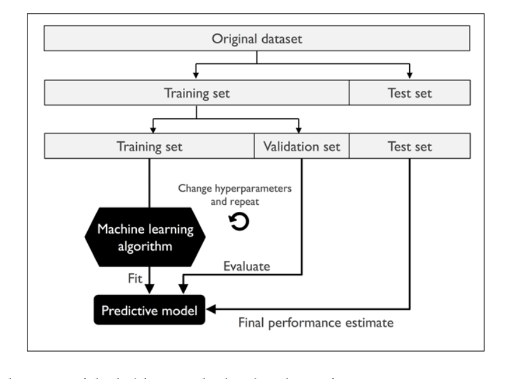
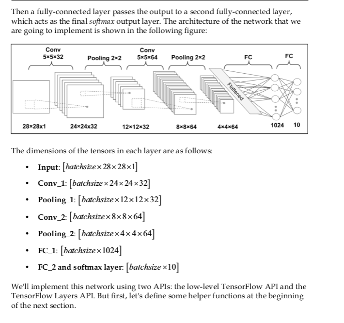

##machine learning process 
1. preprocessing
- Feature extraction and scaling 
- Feature Selection
- Dimensionality Reduction
- Sampling
2. Learning algorithm
- Model Selection
- Cross-Validation
*how do you know which model performs well on the final test dataset and real-world data if we don't use this test set for the model selection, but keep it for the final model evaluation?*.In order to address the issue embedded in this question,different cross-validation techniques can be used where the training dataset is further divided into training and validation subset in order to estimate the **generation** performance of the model.

- Performance Metrics
Evaluating models and predicting unseen dataset
* After we have selected a  model that has been fitted on the training dataset to estimate how well it performs on this unseen data to estimate the generalization error.

- Hyperparameter Optimization
        Supervised learning is composed of two important sub-fields:classification and regression.Unsupervised learning not only offers useful techniques for discovering structures in unlabeled data.
        **but it can also be useful techniques for discovering structures in unlabeled data,but it can also be useful for data compression in feature preprocessing steps**


## Discovering hidden structures with unsupervised learning
1. Finding subgroups with clustering
**clustering** :is also sometimes called **unsupervised classification**


##SSE(sum of squared errors)
1. it can be differentiate
2. it is convex,thus,can use gradient descent to find the local minimum

Adaline learning:batch gradient descent
The cost gradient that is calculated from the whole training set


One of the reasons why standardization helps with gradient descent learning is that the optimizer has to go through fewer steps to find a good or optimal solution(the global cost minimum)


SGD(stochastic gradient descent):
Updates the weights incrementally for each training sample,sometimes also called iterative or online gradient descent


        A compromise between batch gradient descent and stochastic gradient descent is mini-batch learning.Mini-batch learning can be understood as applying batch gradient descent to smaller subsets of the training data. For example,32 examples at a time


```python 

from sklearn.model_selection import train_test_split
X_train,X_test,y_train, y_test=train_test_split(X,y,stratify=y,random_state=1,test_size=.3)

np.bincount(y) 
# //50,50, 50
np.bincount(y_test)
#  // 15,15,15, 


# //standardization
from sklearn.preprocessing import StandardScaler
sc=StandardScaler()
sc.fit(X_train)
X_train_std =sc.transform(X_train)
X_train_std=sc.transform(X_test)

```


Using the preceding code , we loaded the *StandardScaler* class from the *preprocessing* module and initialized a new *StandardScaler* object that we assigned to the *sc* variable.Using the *fit* method,*StandardScaler* estimated the parameter *sample mean*,and *standard deviation* for each dimension from the training data. By calling the *transform* method,we can standardized the training data using the standard mean and deviation


Variance measures the consistency(or variability) of the model prediction for  a particular sample instance  if we retain the model multiple times.**bias** measures how far off the predictions are from the correct values in general.

#logistic regression versus SVM
Logistic regression tries to  maximize the conditional likelihoods of the training data,which makes it more prone to outliers than SVMs,which mostly care about the points that are closet to the decision boundary(support vectors).On the other hand,logistic regression has the advantage that it is a simpler model and can be implemented more easily.Furthermore,logistic regression models can be easily updated,which is attractive when working with streaming data

#Sklearn API 
Sometimes dataset are too large to fit into computer memory.Sklearn offers  alternative implementations  via `SGDClassifier` class,which also supports online learning via the `partial_fit` method.The concept behind the `SGDClassifier` class is similar to the stochastic gradient algorithm 


#kernel methods (opposite to manifold learning or dimension reduction )
The basic idea behind **kernel methods** to deal with such linearly inseparable data is to create nonlinear combinations of the original features to project them onto a higher-dimensional space via a mapping function `f` where it becomes linearly separable.
$$f(x_1,x_2)=(z_1,z_2,z_3)=(x_1,x_2,x_1^2+x_2^2)$$

RBF(radical basis function) kernel is also simply called the **Gaussian kernel**


## Combining multiple decision trees via random forests
Random forests can be considered as an **ensemble** of decision trees. The idea behind a random forest is to average multiple(deep) decision trees that individually suffer from high variance,to build a more robust model that has a better generalization performance and is less susceptible to(influenced by) to over-fitting.

The random forests process :
1. Draw a random **bootstrap** sample of size *n*(randomly choose *n* samples from the training set with replacement)
2. Grow a decision tree from the bootstrap sample.At each node
        - Randomly select *d* features without replacement
        - Split the node using the feature that provides the best split according to the objective function, for instance,maximizing the information gain
3. Repeat the steps 1-2 *k* times 
4. Aggregate the prediction by each tree to assign the class label by *majority vote*.

We should note that one slight modification in step **2**b when we are training the individual decision trees:instead of evaluating all features to determine the best split at each node,we only consider a random subset of those


        sampling with or without replacement:
        In sampling with replacement (有放回抽样),the samples are independent and have a covariance of zero

#Random forests vs Decision Trees
1. Random forests don't offer the same level of interpretiability as decision trees,a big advantage of random forests is that we don't have to worry so much about choosing good hyperparameter values.We typically don't need to prune the random forest since the ensemble model is quote robust to noise from the individual decision trees.The only parameter that we really need to care about in practice is **the number of trees**,the better performance is ,more computational cost 


#KNN
1. Choose the number of *k* and a distance metric 
2. Find the *k-nearest* neighbors of the sample that we want to classify
3. Assign the clas label by majority vote


##The advantage and disadvantage
1. The classifier immediately adapts as we collect new training data 
2. The downside is that the computational complexity for classifying new sample grows linearly with the number of samples in the training dataset.Furthermore,storage space will be a challenge for large datasets


# The curse of dimensionality 
It is important to mention that KNN is very susceptible to overfitting
due to the curse of dimensionality. The curse of dimensionality
describes the phenomenon where the feature space becomes
increasingly sparse for an increasing number of dimensions of a fixed-
size training dataset. Intuitively, we can think of even the closest
neighbors being too far away in a high-dimensional space to give a
good estimate.


# Data Preprocessing
1. Removing and imputing missing values from the dataset
2. Getting categorical data into shape for machine learning algorithms
3. Selecting relevant features for the model construction

```python
# //to check for the missing values
df.isnull().sum()

from sklearn.preprocessing import Imputer
imr=Imputer(missing_values='NaN',strategy='mean',axis =0)
imr=imr.fit(df.values)
imputed_data=imr.transform(df.values)

```
#The **Transformer** classes in the *sklearn*
Just as the **Imputer** class,the transformer class has two essential methods :*fit* and *transform*.The *fit* method is used to learn the parameters from the data, and the *transform* method is used to transform the data

#Nominal and ordinal features
**ordinal** features:can be understood as categorical values that can be sorted and orderes,**nominal** features don't imply any order,like the size of the clothes,XL,L,M
```python
//convert the categorical string values into integers
In [232]: df
Out[232]: 
   color size  price classlabel
0  green    M   10.1     class1
1    red    L   13.5     class2
2   blue   XL   15.3     class1

size_mapping={
        'XL':3, 
        'L':2, 
        'M':1
}
df['size']=df['size'].map({
        'XL':3, 
        'L':2, 
        'M':1
})

In [241]: df
Out[241]: 
   color  size  price classlabel
   0  green     1   10.1     class1
   1    red     2   13.5     class2
   2   blue     3   15.3     class1
# to transform inverse
inv_size_mapping={
        v:k for k,v in size_mapping.items()
}

```

#Encoding class labels 
```python 

class_mapping ={
        label:idx for idx ,label in enumerate(
                np.unique(
                        df['classlabel']
                )
        )
}

df['classlabel']=df['classlabel'].map(class_mapping)
```
Also ,we can use the API:
```python

from sklearn.preprocessing import LabelEncoder
class_le=LabelEncoder()
y=class_le.fit_transform(df['classlabel'].values)

```

#Performing one-hot encoding on nominal features 
An more convenient way to create those dummy features via one-hot encoding is to use the *get_dummies* method in pandas
```python
In [321]: pd.get_dummies(df[['color','price','size']])
Out[321]: 
   price  size  color_blue  color_green  color_red
0   10.1     1           0            1          0
1   13.5     2           0            0          1
2   15.3     3           1            0          0


```

There are two common approaches to bring different features onto the same scale:**normalization** and **standardization**.normalization refers to the re-scaling of the features to arrange of [0,1], which is a special case of **min-max scaling**.$$x_{norm}^{i}=\dfrac{x^{i}-x_{min}}{x_{max}-x_{min}}$$
Here,$x_{i}$ is a particular sample,$x_{min}$ is the smallest value in a feature column, and $x_{max}$ the largest value
```python
from sklearn.preprocessing import MinMaxScaler
mms=MinMaxScaler()
X_train_norm=mms.fit_transform(X_train)
X_test_norm=mms.transform(X_test)

```

Using **standardization**,we center the feature columns at mean 0  with standard deviation 1 so that the feature columns takes the form of a normal distribution,which makes  it easier to learn the weights.Furthermore ,standardization maintains useful information about outliers and makes the algorithm less sensitive to them in contrast to min-max scaling,which scales the data to a limited range of values.
$$x_{std}^{i}=\dfrac{x^i-u_x}{d_x}$$
Standardization can be more practical for many machine learning algorithms ,especially for optimization algorithms such as **gradient descent**.The reason is that may linear models, such as the logistic regression and SVM that initialize the weights to 0 or small random values close to 0.

```python 

from sklearn.preprocessing import StandardScaler
std=StandardScaler()
X_train_std=std.fit_transform(X_train)
X_test_std=std.transform(X_test)
```
#Selecting meaningful features
1. Sequential feature selection algorithms 
**feature selection** and **feature extraction**,via feature selection,we select a subset of the original features,whereas in feature extraction,we derive information from the feature set to construct a new feature subspace.


Sequential feature   selection algorithms are a family of greedy search algorithms that are used to reduce dimension.A classical 
sequential feature selection algorithms is **Sequential Backward Selection**,which aims to reduce the dimensionality of the initial feature subspace with a minimum decay in performance of the classifier to improve upon computational efficiency.      

2. Feature algorithms in sklearn 
Like *recursive backward elimination* based on feature weights,tree-based methods to select features by importance,and univariate statistical tests.

3. Assessing feature importance with random forests 
```python
from sklearn.ensemble import RandomForestClassifier
feat_labels=df_wine.columns[1:]

forest=RandomForestClassifier(n_estimators=500
                                random_state=1)
forest.fit(X_train,y_train)

importances=forest.feature_importances_


```
#Compressing Data via Dimensionality Reduction
- PCA:for unsupervised compression
- LDA(linear discriminant analysis) as a supervised dimensionality reduction technique for maximizing class separability
- Nonlinear dimensionality reduction via **Kernel Principal Component Analysis(KPCA)**

The difference between feature selection and feature extraction is that while we maintain the original features when we used feature selection algorithms,we use feature extraction to transform or project the data onto a new feature space


1. The main steps behind principal component analysis
PCA aims to find the directions of maximum variance in high-dimensional data and projects it onto a new subspace with equal or fewer dimensions than the original one .** The orthogonal axes(principal components) of the constraint that the new feature axes are orthogonal to each other**


2. The PCA process:
- Standardize the *d*-dimensional dataset
- Construct the covariance matrix
- Decompose the covariance matrix int its eigenvectors and eigenvalues
- Sort the eigenvalues by decreasing order to rank the corresponding eigenvectors
- Select *k* eigenvectors which correspond to the *k* largest eigenvalues,where *k* in the dimensionality of the new feature subspace(*k<=d*)
- Construct a projection matrix **W** from the "top" *k* eigenvalues
- Transform the *d*-dimensional input dataset **X** using the projection matrix **W** to obtain the new *k*-dimensional  feature subspace 


```python

from sklearn.model_selection import train_test_split
X_train,X_test,y_train,y_test=train_test_split(df_wine.iloc[:,1:],df_wine.iloc[:,0],test_size=.3,stratify= df_wine.iloc[:,0], random_state=0)
 from sklearn.preprocessing import StandardScaler
  
sc=StandardScaler()
X_train_std=sc.fit_transform(X_train)
X_test_std=sc.transform(X_test)

#compute covariance 
cov_matrix=np.cov(X_train_std.T)
eigen_vals, eigen_vecs=np,linalg.eig(cov_matrix)


```
The covariance between $x_{j}$ and $x_{k}$ is defined as:

$$\sigma_{jk}=\dfrac{1}{n}\sum_{i=1}^{n}(x^i_j-u_j)(x_{k}^i-u_k)$$

Note that the sample means are zero if we standardized the dataset

##Total and Explained variance
Since we want to reduce the dimensionality of our dataset by compressing it onto a new feature subspace,we only select the subset of the eigenvectors(principal components) that contains most of the information(variance)

##Feature transformation
1. select *k* eigenvalues ,which correspond to *k* largest eigenvalues,construct the projection matrix
$$x=xW,X'=XW$$
```python
X_train_std[0].dot(w)
#the W's shape is  2*13 ,x is a 1×13-dimensional row vector,so  the output would be a 1*2 dimension vector

```

##principal component analysis in sklearn
If we are interested in the explained variance ratios of the different principal components,we can simply initialize the PCA class with the *n_components* parameter set to *None*,so all principal components are kept and the explained variance ration can then be accessed via the *explained_variance_ratio_* attribute
```python

pca=PCA(n_components=None)
X_train_pca=pca.fit_transform(X_train_std)
pca.explained_variance_ratio_

```
##supervised data compression via linear discriminant analysis
LDA(linear discriminant analysis) can be used as a technique for feature extraction to increase the computional efficiency and reduce the degree of over-fitting due to the curse of dimensionality in non-regularized models


**The general concept behind LDA is very similar to PCA.The goal in LDA is to find the feature subspace that optimizes class separability**

1. The inner workings of linear discriminant analysis
- Standardize the *d*-dimensional dataset(*d* is the number of features)
- For each class, compute the *d*-dimensional mean vector 
- Construct the between-class scatter matrix $S_{B}$ and the within-class scatter matrix $S_{W}$
- Compute the eigenvectors and corresponding eigenvalues of the matrix $S_{W}^{-1}S_{B}$
- Sort the eigenvalues by decreasing order to rank the corresponding eigenvectors 
- Choose the *k* eigenvalues that correspond to the *k* largest eigenvalues to construct a *d\*k* -dimensional transformation matrix $W$; the eigenvectors are the columns of this matrix
- Project   the samples onto the new feature subspace using the transformation matrix $W$
2. Computing the scatter matrices
To construct the within-class scatter matrix and between-class scatter matrix
$$S_{W}=\sum_{i=1}^{c}S_{i}$$,
$$S_{i}=\sum_{x\in{D_{i}}}^{c}{(x-m_{i})(x-m_{i})^T}$$
and the within-class scatter matrix(or covariance matrix) ,between-class scatter matix 
$$S_{B}=\sum_{i=1}^{c}n_i(m_i-m)(m_i-m)^T$$
Here,the $m$ is the overall mean 
3. Selecting linear discriminant for the new feature subspace
The remaining steps of the LDA are similar to the steps of  the PCA.However,instead of performing the eigendecomposition on the covariance matrix. We solve the generalized eigenvalue problem of the matrix $S_W^{-1}S_{B}$
4. LDA via sklearn
```python
from sklearn.discriminant_analysis import LinearDiscriminantAnalysis as LDA 
lda=LDA(n_components=2)
X_train_lda=lda.fit_transform(X_train_std,y_train)
```

##Kernel functions and the kernel trick
The most commonly used kernels are as follows:
- The polynomial kernel:
$$K(x_{i},x_{j})=(x^{(i)T}x^{(j)}+\theta)^p$$
Here,$\theta$ is the threshold and $p$ is the power that has to be specified by the user
- The hyperbolic tangent(sigmoid) kernel：
$$K(x_{i},x_{j})=\tanh(\eta{x^{(i)T}x^{(j)}+\theta)}$$
- The RBF kernel or Gauss kernel:
##Kernel PCA in sklearn
```python

from sklearn.decomposition import KernelPCA
kpc=KernelPCA(n_components=2,kernel='rbf',gamma=15)
X_kpc=kpc.fit_transform(X)

```

#Manifold learning
#Model Evaluation and Hyperparameter Tuning
```python
from sklearn.preprocessing import StandardScaler
from sklearn.decomposition import PCA
from sklearn.linear_model import LogisticRegression
from sklearn.pipeline import make_pipeline

pipe_lr=make_pipeline(StandardScaler(),PCA(n_components=2),LogisticRegression(random_state=1))

pipe_lr.fit(X_train,y_train)

y_pred=pipe_lr.predict(X_test)
```
## Cross Validation 
The initial data is separated into three parts:a training set,used to fit the different models,a validation ,used for the model selection,and a test set that can help the model generalize to new data


**we use k-fold cross-validation for model tuning,that is,finding the optimal hyperparameter values that yields a satisfying generalization performance**


```python
from sklearn.model_selection import StratifiedKFold 

kfold=StratifiedKFold(n_splits=10,random_state=1).split(X_train,y_train)

scores=[]

for k ,(train ,test) in enumerate(kfold):
        pipe_lr,fit(X_train[train],y_train[train])
        score=pipe_lr.score(X_train[test],y_train[test])
        scores.append(score)
        print('Fold:%2d ,Class dist:%s,ACC:%.3f' % (k+1,np.bincount(y_train[train]),score))

```

## Debugging algorithms with learning and validation curves
1. **learning curves** and **validation curves** 
- Diagnosing bias and variance problems with learning curves 
```python
import matplotlib.pyplot as plt 
from sklearn.model_selection import learning_curve

pipe_lr=make_pipeline(StandardScaler(),
                      LogisticRegression(penalty='12'
                                        random_state=1))
train_sizes,train_scores,test_scores=learning_curve(
        estimator=pipe_lr,X=X_train,y=y_train,train_sized=np.linspace(
            0.1,1.0,10
        ),cv=10,n_jobs=1
)
```
- Addressing over- and underfitting with validation curves
**Validation curves** are a useful tool for improving the performance of a model by addressing issues such as overfitting or underfitting,but instead of plotting the training and test accuracies as functions of the sample size,we vary the values of the model parameters,for example,the inverse regularization  parameter *C* in logistic regression.
```python
from sklearn.model_selection import validation_curve
param_range=[0.001,0.01,0.1,1.0,10.0,100.0]
train_scores,test_scores=validation_curve(
    estimator=pipe_lr,
    X=X_train,
    y=y_train,
    param_name='logisticregression_C', 
    param_range=param_range,
    cv=10
)
```
2. Fine-tuning machine learning models via grid search
*In machine learning,we have two types of parameters:those that are learned from the training data,for example,the weights in logistic regression,and the parameters of a learning algorithm that are optimized separately.The latter are the tuning parameters,also called hyper-parameters,of a model, for the example,the regularization parameter in logistic regression or the depth parameter of a decision tree*

- Tuning hyper-parameters via grid search  
The computer evaluates the model performance for each combination of those to obtain the optimal combination of values from this set
```python
from sklearn.model_selection import GridSearchCV
from sklearn.svm import SVC 

pipe svc=make_pipeline(StandardScaler(),
                        SVC(random_state=1)

)
param_range=[
    {
        'svc_C':param_range,
        'svc_kernel':['linear'],
    
    },
    {
        'svc_C':param_range,
        'svc_gamma':param_range,
        'svc_kernel':['rbf']
    }
]
gs=GridSearchCV(
   estimator =pipe_svc,
   param_grid=param_grid,
   scoring='accuracy',
   cv =10,
   n_jobs=-1
)
gs=gs.fit(X_train,y_train)
print(gs.best_score_)
print(gs.best_params_)

# the best_selected model
clf=gs.best_estimator_
clf.fit(X_train,y_train)

```

Although grid search is a powerful approach for finding the optimal set of parameters,the evaluation of all possible parameter combinations is also computationally very expensive.An alternative approach to sampling different parameter combinations is *RandomizedSearchCV*


##Algorithm selection with nested cross-validation


##Looking at different performance evaluation metrics
Such as precision,recall ,and the F1-score
1. Reading a confusion matrix

| | P | N |
|----------|:-------------:|------:| 
|P|True positives(TP)|False negatives(FN)|
|N|False positives(FP)|True negatives(TN) |


##Optimizing the precision and recall of a classification model
**error** and **accuracy** are defined by:
$$ERR=\dfrac{FP+FN}{FP+FN+TP+TN}$$
The **True positive rate(TPR)** and **False positive rate(FPR)** are performance metrics that are especially  useful for imbalanced class problems:
$$FPR=\dfrac{TP}{p}=\dfrac{FP}{FP+TN}$$
$$TPR=\dfrac{TP}{P}=\dfrac{TP}{FN+TP}$$

The performance metrics **precision(PRE)** and **recall(REC)** are related to those true positive and negative rates, and in fact,REC is synonymous with TPR:

$$ PRE=\dfrac{TP}{TP+FP}$$
$$REC=TPR=\dfrac{TP}{P}=\dfrac{TP}{FN+TP}$$ 

The **F1-score** is defined :
$$F1=2\dfrac{PRE*REC}{PRE+REC}$$

##Plotting a receiver operating characteristic
**Receiver operating characteristic(ROC)** graphs are useful tools to select models for classification based on their performance with respect to the *FPR* and *TPR*,which are computed by shifting the decision threshold of the classifier.*The diagonal of the ROC graph can be interpreted as random guessing,and classification models that fall below the diagonal are considered as worse than random guessing*.A perfect classifier would fall into the top left corner of the graph with a *TPR* of 1 and an *FPR* of 0.Based on the *ROC* curve,we can then compute the so-called *ROC Area Under the Curve(ROC AUC)* to characterize the performance of a classification model
#Dealing with class imbalance
One way to deal with imbalanced class proportions during model fitting to assign a larger penalty to wrong predictions on the minority class.Other popular strategies for dealing with class imbalance include up-sampling the minority class,down-sampling the majority class,and the generation of synthetic training samples


The `resample` function can help with the up-sampling of the minority class by drawing new samples from the data-set with replacement
```python
from sklearn.utils import resample
X_unsampled,y_unsampled=resample(
    X_imb[y_imb==1],
    y_imb[y_imb==1],
    replace=True,
    n_samples=X_imb[y_imb==0].shape[0],
    random_state=1
)
```
Another technique for dealing with class imbalance is the generation of synthetic training samples ,the probably most used algorithm for synthetic training sample generation is **Synthetic Minority Over-sampling Technique(SMOTE)**

#Ensemble Learning 
- Make predictions based on majority voting 
- Use bagging to reduce overfitting by drawing random combinations of the training set with repetition
- Apply boosting  to build powerful models from *weak learners* that learn from their mistakes
##Majority voting  
**Majority voting**:it means that we select the class label that has been predicted by the majority of classifiers, that is,received more than 50 percent of the votes.Strictly speaking,the term **majority vote** refers to binary class settings only.However ,it id easy to generalize the majority voting principle to multi-class settings,which is called **plurality voting**

## stacking
The stacking algorithm can be understood as a two-layer ensemble,where the first layer consists of individual classifiers that feed their predictions to the second level,where another classifier(typically logistic regression) is fit to the level-1 classifier predictions to make the final predictions.


##Bagging-building an ensembles of classifiers from bootstrap samples
Instead of using the same training set to fit the individual classifiers in the ensemble,we draw bootstrap samples (random samples with replacement) from  the initial training set,which is why bagging is also known as **bootstrap aggregating**

Once the individual classifiers are fit to the bootstrap samples,the predictions are combined using majority voting


        Note that bagging is also  related to the random forest classifier .In fact,random forests are a special case of bagging where we also use the feature subsets when fitting the individual decision trees

We shall note that the bagging algorithm can be an effective approach to reduce the variance of a model.However,bagging is ineffective in reducing model bias,that is,models that are too simple to capture the trend in the data well.This is why we want to perform bagging on an ensemble of classifiers with low bias,for example, un-pruned decision trees
## boosting
 how boosting works  
Boosting can lead to a decrease in bias as well as variance compared to bagging models.However,boosting algorithms such as AdaBoost are also known for their high variance,that is, the tendency to over-fit the training data.


# Introducing the bag-of-words model
1. We create a vocabulary of unique tokens-for example,words-from the entire set of documents
2. We construct a feature vector from each document that contains the counts of how often each word occurs in the particular document

Since the unique words in each doc represent only a small subset of all the words in the bag-of-words vocabulary,the feature vectors will mostly consist of zeros,which is **sparse**.

-transforming words into feature vectors 
```python

from sklearn.feature_extraction.text import CountVectorizer
count=CountVectorizer()
docs=np.array([
    'the sun is rising',
    'the weather is sweet',
    'the sun is rising and the weather is sweet'
])
bag=count.fit_transform(docs)
In [124]: count.vocabulary_
Out[124]: {'and': 0, 'is': 1, 'rising': 2, 'sun': 3, 'sweet': 4, 'the': 5, 'weather': 6}

In [127]: bag.toarray()
Out[127]: 
array([[0, 1, 1, 1, 0, 1, 0],
       [0, 1, 0, 0, 1, 1, 1],
       [1, 2, 1, 1, 1, 2, 1]], dtype=int64)
 
```
The number in the matrix `tf(t,d)`(raw term frequency) means the occurance in  the sentences(one column represents a sentence)
- by calling the `fit_transform` method on `CountVectorizer`,we constructed the vocabulary of the bag-of-words model and transform the following three sentences into sparse feature vectors:
- Assessing word relevancy via term frequency-inverse document frequency 
**term frequency-inverse document frequency(tf-idf)**:used to down-weight these frequently occurring   words in the feature vectors.The tf-idf can be defined as the product  of the term frequentcy and the inverse document frequency:

$$tf-idf(t,d)=tf(t,d)*idf(t,d)$$
Here the `idf(t,d)` is the inverse doc frequency:
$$idf(t,d)=log\dfrac{n_d}{1+df(d,t)}$$
here the $n_d$ is the total number of docs,and $df(d,t)$ id the number of docs $d$ that contain the term $t$.Note that adding the constant $1$ to the denominator is optional and serves the purpose of assigning a non-zero value to terms that occur in all training samples
```python
from sklearn.feature_extraction.text import TfidfTransformer
tfidf=TfidfTransformer(
    use_idf=True,
    norm ='l2',
    smooth_idf=True
)
np.set_printoptions(precision=2)
tfidf.fit_transform(count.fit_transform(docs)
```

The $idf(t,d)$ in sklearn is defined:$$idf(t,d)=log\dfrac{1+n_d}{1+df(d,t)}$$,similarly,the `tf-idf` is defined:
$$tf-idf(t,d)=tf(t,d)*(idf(t,d)+1)$$


## cleaning text data
using regular expression
## processing docs  into tokens
One way to *tokenize* docs is to split them into individual   words by splitting the cleaned docs at its whitespace characters,another way is **word stemming**,which is the process of transforming a word into its root form.It allows us to map related words to the same stem.
```python

from nltk.stem.porter import PorterStemmer
porter=PorterStemmer()
def tokenizer(text):
    return [porter.stem(word) for word in text.split()]
# tokenizer('runner like running and thus they run')
In [162]: tokenizer('runner like running and thus they run')
Out[162]: ['runner', 'like', 'run', 'and', 'thu', 'they', 'run']


```
Other stemming algorithm like snowball stemmer and the  lancaster stemmer


## Stop-word removal
Stop-words are simply those words that are extremely common in all sorts of texts and probably bear no(or only little) useful information that can be used to distinguish between different classes of docs,like *is,and,has,like*.Removing those words can be useful with raw or normalized term frequencies rather thn tf-idfs,which are down-weighting frequently occurring words
```python

from nltk.corpus import stopwords
stop=stopwords.words('english')
[w for w in tokenizer('a runner likes running and runs a lot')[-10:] if w not in stop]

['runner','like','run','run','lot']
```
## Working with bigger data-online algorithms and out-of-core learning
**out-oof-core learning**:it allows us to work with such large datasets by fitting the classifier incrementally  on smaller batches of the data-set.  
**stochastic gradient descent**:an optimization algorithm that updates the model's weights using at a time.In this section,we will make use of the `partial_function` of the `SGDClassifier` in sklearn to stream the docs directly from our local drive,and train a logistic regression model using small mini-batches docs
```python

def stream_docs(path):
    with open(path,'r',encoding='utf-8') as csv:
        next(csv)
        # skip head
        for line in csv:
            text,label=line[:,-3],int(line[-2])
            yield text,label
            
        pass
    pass

next(stream_docs(path='movie_data.csv'))

```
Unfortunately,we can't use `CountVectorizer` for out-of-core learning since it requires holding the complete vocabulary in memory.Also,`TfidfVectorizer` needs to keep all the feature vectors of the training data-set in memory to calculate the inverse document frequencies.However, another useful vectorizer for text preprocessing implemented in sklearn is `HashingVectorizer` is data-independent abd makes use of the hashing trick via the 32bit MurmurHash3 function

```python


from sklearn.feature_extraction.text import HashingVectorizer
from sklearn.linear_model import SGDClassifier
vect=HashingVectorizer(decode_error='ignore',n_features=2**21,preprocessor=None,tokenizer=tokenizer)

clf=SGDClassifier(loss='log',random_state=1,n_iter=1)
doc_stream=stream_docs(path='movie_data.csv')
```

## `pyprind` using
```python

import pyprind,numpy as np
pbar=pyprind.prog_bar(45)
classes=np.array([0,1])
for _ in range(45):
    X_train,y_train=get_minibatch(doc_stream,size=100)
    if not X_train:
        break
    X_train=vect.transform(X_train)
    clf.partial_fit(X_train,y_train,classes=classes)
    pbar.update()
    pass
    
```
A more modern alternative to the *bag-of-words* model is *word2vec*, which is an unsupervised learning algorithm based on neural networks that attempts to automatically learn the relationship between words.**The basic idea id to put words that have similar clusters,and via clever vector-spacing,the model can reproduce certain words using simple vector math,for example,king-man+woman=queen.**

## Topic modeling with Latent Dirichlet Allocation
LDA(latent dirichlet allocation,different from linear discriminant analysis):is a generative probabilistic model that appear frequently together across different docs.These frequently appearing words  our topics,assuming that each doc is a mixture of different words.The input to LDA is the bag-of-words model we discussed earlier.

Given a bag-of-words matrix as input, LDA decomposes it into two new matrices:
- A document to topic matrix
- A word to topic matrix

## LDA in sklearn
```python


from sklearn.feature_extraction.text import CountVectorizer
count=CountVectorizer(stop_words='english',max_df=.1,max_features=5000)
from sklearn.decomposition import LatentDirichletAllocation
lda=LatentDirichletAllocation(n_topics=10,random_state=123,learning_method='batch')
X_topic=lda.fit_transform(X)

lda.components_.shape


# to analyze the results
feature_names=count.get_feature_names()
for topic_idx,topic in enumerate(lda.components_:
    print("topic %d:" % (topic_idx+1))
    print("".join(feature_names[i] for i in topic.argsort() [:-n_top_words -1:-1]))
    pass
```

## Embedding a Machine Learning Model into a Web Application
- Saving the current state of a trained machine learning model
- Using SQLite databases for data storage
- Developing a web application using the popular Flask web framework 
- Deploying a machine learning application to a public web server
1. Serializing fitted sklearn estimators
Using the `pickle` module to serialize and deserialize  Python object structures to compact bytecode so that we can save our classifier in its current state and reload it if we want to classify new samples,without needing the model to learn from the training data all over again.
```python

import pickle,os

stop=stopwords.words('english')
dest=os.path.join('movieclassifier','pkl_objects')
if not os.path.exists(dest):
    os.makedirs(dest)


pickle.dump(stop,open(os.path.join(dest,'stopwords.pkl'),'wb'),protocol=4)

pickle.dump(clf,open(os.path.join(dest,'classifier.pkl'),'wb'),protocol=4)
```

## Visualizing the important characteristics of a dataset（Exploratory data Analysis)
`seaborn` is based on the `matplotlib` to draw statistical plots 
```python
import seaborn as sns
cols=['LSTAT','INDUS','NOX','RM','MEDV']
sns.pairplot(df[cols],size=2.5)
# to visualize the pair-wise correlations
```
## Looking at relationship using a correlation matrix
The correlation matrix is a square matrix that contains the **Pearson product-moment correlation coefficient**,which measures the linear dependence between pairs of features.

$$r=\dfrac{\delta_{xy}}{\delta_x\delta_y}$$

To draw a heatmap
```python

import numpy as np,seaborn as sns
cm=np.corrcoef(df[cols].values.T)
sns.set(font_scale=1.5)
sns.heatmap(cm,cbar=True,annot=True,square=True,fmt='.2f',annot_kws={'size':15},yticklabels=cols,xticklabels=cols)
```
## Linear Regression
```python
X=df['RM'].values
from sklearn.preprocessing import StandardScaler
sc_x=StandardScaler()
sc_y=StandardScaler()
X_std=sc_x.fit_transform(X[:,np.newaxis]).flatten()
y_std=sc_y.fit_transform(y[:,np.newaxis]).flatten()
lr=LinearRegressionGD()
lr.fit(X_std,y_std)

```
## Fitting a robust regression model using RANSAC
As an alternative to throwing out outliers,we will look at a robust method of regression using the **RAndom SAmple Consensus(RANSAC)** algorithm,which fits a regression model to a subset of the data,the so-called **inliers**  

The algorithm runs as follows:
- Select a random number of samples to be inliers and fit the model
- Test all other data points against the fitted model and add those points that fall within a user-given tolerance to the inliers
- Refit the model using all inliers
- Estimate the error of the fitted model versus the inliers
- Terminate the algorithm if the performance meets a certain user-defined threshold or if a fixed number of iterations were reached;go back to step1 otherwise


```python 

form sklearn.linear_model import RANSACRegressor

ransac=RANSACRegressor(LinearRegression(),
                        max_trials=100,
                        min_sample=50
                        loss='absolute_loss'
                        residual_threshold=5.0
                        random_state=0)
ransac.fit(X,y)


inner=ransac.inler_mask_
outer=np.logical_not(inner)

scatter(X[inner],y[inner],c='blue')
scatter(X[outer],y[outer],c='red')

```

## Evaluating the performance of linear regression models
**Residual plots** are a commonly used graphical tool for diagnosing regression models.They can help detect non-linearity and outliers,and check whether the errors are randomly distributed


Sometimes it may be more useful to report the *coefficient of determination*$(R^2)$,which can be understood as a standardized version of the MSE,for better interpretability of the model's performance.Or in other words,$R^2$ id the fraction of response variance that is captured by the model. It is defined as:
$$R^2=1-\dfrac{SSE}{SST}$$
Here,SSE is the sum of squared errors and SST is the total sum of squares:
$$SST=\sum_{i=1}^{n}(y^i-\mu_y)^2$$ 
In other words,SST is simply the variance of the MSE
$$SSE=\sum_{i=1}^n(y^i-\tilde{y}^i)^2$$

## Adding polynomial terms using sklearn 
Using  polymnomialFeatures is to increase dimensions of data just like kernel methods


## Random Forests


A random forest, which is an ensemble of multiple **deision trees**,can b understood as the sum of piece-wise linear function in contrast to the global linear and polynomial regression models that we discussed previously. In other words,via the decision tree algorithm ,we are subdividing the input space into smaller regions that become more *manageable*

## Random forest regression

A random forest has a better performance that an individual decision tree due to randomness,which helps to decrease the model's variance.**Other advantages of random forests are that they are less sensitive to outliers in the outliers in the data-set and don't require much parameter tuning.** The only parameter in random forests that we typically need to experiment with is the number of trees in the ensemble 


## Clustering
1. prototype-based clustering
2. hierarchical clustering

        One advantage of hierarchical clustering algorithms is that it allows us to plot dendrograms(visualization of a binary hierarchical clustering),which can help with the interpretation of the results by creating meaningful taxonomies.Another useful advantage of this hierarchical approach is that we do not need to specify the number of clusters up front

3. density-based clustering 
Density-based Spatial Clustering of Applications with Noise(DBSCAN),which does not make assumptions about spherical clusters like k-means,nor does it partition the dataset into hierarchies that require a manual cut-off point.    

**DBSCAN** has two hyperparameters,like *MinPts* and *epsio*
4. graph-based clustering 
Like **spectral clustering** algorithms,they all use the eigenvectors of a similarity 


## CNNs
Depending the choice *p* (padding),boundary cells may be differently than the cells located in the middle *x*(can be in computations many times)  

Furthermore,the size of the output *y* also depends on the choice of the padding strategy.There are three modes of padding that are commonly used in practice:**full,same** and **valid**  
- In the **full** mode, the padding parameter *p*  is set to *p=m-1*.(*m* means the filter length).Full padding increases the dimensions of the output;thus, it is rarely used in convolutional neural network architectures
- **Same** padding is usually used if you want to have the same as the input vector **x**. In this case , the padding parameter *p* is computed according to the filter size,along the  requirement that the input size and output size are the same
- **Valid** mode refers to the case where *p=0*(no padding)

The most commonly used padding mode in CNN is **same** padding.One of its advantages over the other padding modes is that same padding preserves the height and width of the input images or tensors,which makes designing a network architecture more convenient.  
 
One big disadvantage of the **valid** padding versus and **full** and **same**  padding,is that the volume of the tensors would decrease substantially in neural networks with many layers,which be detrimental to the network performance   


## Determining the size of the convolution output
The output size of a convolution is determined by the total number of times that we shift the filter **w** along the input vector. Assuming that the input vector has size *n* and the filter is of size *m*. Then,the size of the output resulting from *x\*w* with padding *p* and stride *s* is determined as follows:
$$o=\left\lfloor{\dfrac{n+2p-m}{s}}\right\rfloor+1$$

## Subsampling
Typically applied in two forms of pooling operations in convolutional neural networks:**max-pooling** and **mean-pooling**

- Pooling(max-pooling) introduces some sort of local in-variance.This means that small changes in a local neighborhood do not change th result of max-pooling.Therefore,,it helps generate features that are more robust to noise in the input data.
- Pooling decreases the  size of features,which results in higher computational  efficiency.Furthermore, reducing the number of features may reduce the degree of over-fitting as well   


**Traditionally,pooling is assumed to be non-overlapping.Pooling is typically performed on non-overlapping neighborhoods, which can be done by setting the stride parameter equal to the pooling size**.   

On the other hand,overlapping pooling occurs if the stride is smaller than pooling size.   

A convolutional layer of a CNN has more than one feature map.If we use multiple feature maps,the kernel tensor becomes four-dimensional:$weight*height*C_{in}*C_{out}$,here $weight*height$ is the kernel size.$C_{in}$ is the number of input channels,and $C_{out}$ is the number of output feature maps.   


## Dropout
The *p* means that the keep probability,the keeping units divides all the hidden units   


The multi-CNN process


`AdamOptimizer` function for training the CNN model.The Adam optimizer is a robust gradient-based optimization method suited for **non-convex** optimization and machine problems.The key advantage of Adam is in the choice of update step size derived from the running average of gradient moments

## RNN
RNNs are designed for modeling sequences and are capable of remembering past information and processing new events accordingly

## The different categories of sequence modeling
- Many-to-one:The input data is a sequence,but the output is a fixed-size vector,not a sequence. For example,in sentiment analysis, the input is text-based and the output is a class label
- One-to-many: The input data is in standard format,not a sequence,but the  output is a sequence. An example is image captioning-the input is an image;the output is an English phrase.
- Many-to-many:Both the input and output arrays are sequences. This category  can be divided based on whether the input and output are synchronized or not.An example of **synchronized** many-to-many modeling task is video classification, where each frame in a video is labeled. An example of a **delayed** many-to-many would be translating a language into another.For example,an entire English sentence must be read and processed by a machine before producing its translation into German
